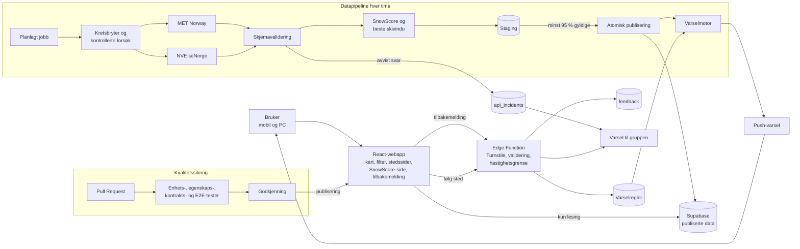

# SnowFinder – Produktbrief

**IBE160 Programmering med KI | Gruppe G18**

*Finn de beste prognostiserte forholdene – før alle andre.*

## Executive Summary

SnowFinder er en webapp for alle som er ute etter snø. Den finner stedene og tidspunktene med best prognostiserte snøforhold blant stedene i katalogen. Brukeren ser landet fargelagt etter forholdene, filtrerer på egne krav som «minst 15 mm nysnø og vind under 6 m/s», og kan få varsel på mobilen når et sted oppfyller kravene.

Kjernen er **SnowScore**, én forklarbar poengsum fra 0 til 100 som viser snøpotensialet på et sted. Formelen er åpen, og en egen side på nettsiden forklarer steg for steg hvordan den beregnes.

Bak brukeropplevelsen ligger en datapipeline som henter, validerer og publiserer data hver time. Nettsiden leser kun ferdig kvalitetssikrede data og fungerer videre selv om en datakilde faller ut. SnowFinder viser prognostiserte og modellerte forhold, ikke garanterte løypeforhold eller skredsikkerhet.

## The Problem

Den som vil finne snø, må i dag sjekke flere tjenester og selv vurdere om nedbøren blir snø, om det blåser for mye og når på dagen det klarner opp. Informasjonen er fragmentert, rådataene svarer ikke på hvor og når forholdene er best, og ingen tjeneste lar deg spørre «hvor i Norge oppfylles kravene mine nå?».

## Target Users

**Skientusiaster** som jakter nysnø og gode skiforhold er den primære målgruppen. **Turentusiaster** som går vinterturer og toppturer, og som vil finne snø med lite vind, er sekundær målgruppe. Tjenesten er åpen for alle, både fastboende og tilreisende.

- *Som skientusiast vil jeg finne alle skisteder med minst 15 mm nysnø neste døgn, slik at jeg kan velge sted for helgen.*
- *Som turgåer vil jeg finne topper med nysnø og vind under 6 m/s, slik at jeg får en god vintertur.*
- *Som skientusiast vil jeg få varsel når favorittstedet mitt får pudder, slik at jeg ikke går glipp av det.*

## The Solution

### Norgeskartet

Startsiden er et kart over Norge der alle steder i katalogen er fargelagt etter SnowScore, fra grått for lite snøpotensial til sterkt blått for de beste stedene. Et trykk på et sted åpner stedssiden.

### Stedssiden

Hvert sted har en egen side med unik adresse som viser poengsum med delpoeng, temperatur, nysnø, vind, skydekke, høyde og datakildens tidsstempel. Siden viser også **beste skivindu**: de fire sammenhengende dagslystimene de neste 48 timene uten nedbør, med lavest snittvind og minst skydekke. Kommer det nysnø i perioden, velges bare vinduer etter at snøfallet har stoppet, for eksempel «Best i morgen kl. 09–13, etter nattens snøfall».

### Filter

Filteret gjennomsøker hele stedskatalogen og viser bare steder som oppfyller alle krav.

| **Filter** | **Innstilling** | **Datagrunnlag** |
|---|---|---|
| Nysnø | Minimum i mm vannekvivalent, med anslag i cm | Neste 24/48 t: MET. Siste 24 t: NVE seNorge |
| Vind | Maks middelvind og vindkast (m/s) | MET |
| Sol | Maks skydekke i dagslystimer (%) | MET |
| Temperatur | Min- og maksverdi (°C) | MET, korrigert for stedets høyde |
| Avstand | Maks avstand fra brukerens posisjon (km) | Posisjon i nettleseren, lagres aldri |
| Stedstype | Skisted, fjelltopp, by | Stedskatalog |

Filteret kaller en parameterisert databasefunksjon mot en forhåndsberegnet, indeksert tabell og svarer på under to sekunder. Avstand beregnes i nettleseren på treffene som kommer tilbake, slik at posisjonen aldri forlater enheten. Antall treff oppdateres mens glidebryterne justeres, og ved null treff foreslås hvilket krav som bør lempes. Hurtigvalg som «Pudderdag» og «Sol etter snøfall» fyller inn filteret med ett trykk, og filterverdiene lagres i nettadressen slik at søk kan deles med en enkel lenke.

### Snøvarsel

Brukeren kan følge et sted med en terskel, for eksempel «Varsle meg når Trysil får over 15 mm nysnø», og få push-varsel på mobilen når kravet oppfylles. Varsler krever ingen brukerkonto, og registrering skjer gjennom en Edge Function som validerer terskelen og begrenser antall regler per enhet. Etter hver publisering sjekker pipelinen varselreglene mot de nye dataene, sender maksimalt ett varsel per regel per døgn, og hvert varsel har avmelding med ett klikk. SnowFinder kan legges på hjemskjermen som en installerbar webapp, noe som er nødvendig for push-varsler på iPhone.

### Siden «Slik beregner vi SnowScore»

En egen side på nettsiden forklarer SnowScore slik at hvem som helst kan forstå og etterprøve den:

1. **Kort fortalt:** hva SnowScore måler, og hva den ikke måler, i tre setninger.
2. **Steg for steg:** hvordan nedbør og temperatur blir til snøandel, nysnø og de tre delpoengene, med formelen og en illustrasjon av hver del.
3. **Prøv selv:** en kalkulator der brukeren justerer nedbør og temperatur og ser poengsummen og delpoengene endre seg umiddelbart.
4. **Regneeksempel:** et komplett eksempel fra rådata til ferdig poengsum.
5. **Datakilder og begrensninger:** hvor dataene kommer fra, hvorfor dette er prognoser og ikke målt snø, og hvorfor vind vises separat.
6. **Endringslogg:** versjonsnummer og begrunnelse for alle justeringer av parameterne.

Kalkulatoren og pipelinen bruker nøyaktig samme beregningsmodul, slik at forklaringen og poengsummene i løsningen aldri kan sprike fra hverandre. Hver SnowScore i løsningen lenker til siden.

### Tilbakemelding uten konto

En egen fane lar brukere sende tilbakemeldinger direkte til gruppen uten innlogging, navn eller e-post. Skjemaet ber brukeren om ikke å skrive personopplysninger i fritekstfeltet. Skjemaet har kategori (feil, forslag, datakvalitet) og fritekst på inntil 1 000 tegn. Innsendingen går til en Supabase Edge Function som:

1. verifiserer et Cloudflare Turnstile-token mot automatiserte angrep,
2. validerer innholdet mot et fast skjema,
3. begrenser antall innsendinger med en kortlevd, saltet hash som slettes etter 24 timer,
4. lagrer tilbakemeldingen selv, siden klienten ikke har noen direkte tilgang til tabellen og kontrollene dermed ikke kan omgås,
5. varsler gruppen i en privat kanal.

Tilbakemeldinger slettes automatisk etter tolv måneder.

### Innebygd kvalitetssikring

- **Egenskapsbaserte tester** av SnowScore med tusenvis av tilfeldige inndata, som bekrefter at poengsummen alltid ligger mellom 0 og 100, at mer snø aldri gir lavere nysnøpoeng, at lavere temperatur aldri gir lavere kuldepoeng, og at samme inndata alltid gir samme resultat.
- **Kontraktstester** mot lagrede API-svar fra MET og NVE.
- **End-to-end-tester** av kart, filter og stedsside, samt av «bør ha»-funksjoner som snøvarsel og tilbakemelding etter hvert som de implementeres.
- **Sikkerhetstester** som bekrefter at klienten ikke kan lese tilbakemeldinger, varselregler eller push-abonnementer, at Row Level Security blokkerer all uautorisert tilgang, at alle Edge Functions validerer data på serversiden, at fritekst behandles som utrygt innhold og ikke kan injisere kode, at hemmelige nøkler aldri havner i frontend-koden, og at avmelding faktisk sletter varselregelen.
- **Manuell kontroll** av et fast utvalg steder mot MET og test på mobil og PC.
- **Oppgavebasert brukertest** med minst fem personer, som måler om de klarer å finne et aktuelt sted, justere filteret, forklare en SnowScore, oppdage utdaterte data og skille prognose fra faktiske forhold.
- **Sperret hovedgren:** kode flettes bare inn via Pull Request med grønne tester og godkjenning fra et gruppemedlem.

## Scope for Version 1

| **Prioritet** | **Funksjoner** |
|---|---|
| Må ha | Norgeskart, stedssider, stedskatalog, datapipeline med validering, SnowScore med forklaringsside, filter for nysnø (prognose), vind og temperatur, robust feilhåndtering, CI med tester |
| Bør ha | Beste skivindu, kalkulator på forklaringssiden, snøvarsel, solfilter, avstandsfilter, nysnø siste 24 t, tilbakemelding uten konto |
| Ikke i v1 | Brukerkontoer, flere språk, webkameraer, app i appbutikkene, skredvarsling, målt snødybde, booking, generativ værchat |

Versjon 1 har bevisst ingen brukerkontoer. Det gjør løsningen enklere, reduserer angrepsflaten og holder behandlingen av personopplysninger på et minimum.

## Data Sources and Pipeline

| **Kilde** | **Bruk** |
|---|---|
| MET Norway Locationforecast | Timesprognose for nedbør, temperatur, vind og skydekke |
| NVE GridTimeSeries (seNorge) | Modellert nysnø siste døgn |
| Kartverket | Stedsnavn, koordinater og høyde |
| OpenStreetMap | Skianlegg og kartgrunnlag |

Alle kilder krediteres i tråd med lisensene sine (CC BY 4.0, NLOD og ODbL), synlig i kartet og på forklaringssiden.

**Stedskatalogen** bygges fra OpenStreetMap (skianlegg og langrennsarenaer), Kartverket (navngitte fjelltopper og tettsteder) og en manuelt kvalitetssikret liste, Versjon 1 starter med ca. 300 nøye utvalgte steder. Katalogen utvides mot 1 500 steder først når pipelinen har kjørt stabilt, siden arkitekturen tåler økningen uten endringer. OpenStreetMap og Kartverket brukes bare når katalogen bygges, ikke i den løpende datainnhentingen.

**Pipelinen** kjører hver time som en køstyrt jobb i puljer, slik at ingen enkeltkjøring overskrider tidsgrensene i Supabase og en avbrutt kjøring fortsetter der den slapp:

1. Koordinater avrundes til fire desimaler og sendes med stedets høyde, slik at MET korrigerer temperaturen for terrenget.
2. Kall sendes med identifiserende User-Agent og `If-Modified-Since`, og data hentes bare på nytt når `Expires` er passert. Samtidige kall begrenses, og lasten holdes godt innenfor METs vilkår.
3. Hvert svar valideres mot et strengt skjema. Ugyldige svar avvises og logges, de rettes aldri automatisk.
4. Alle tidspunkter lagres i UTC og vises i norsk tid med riktig sommertid. Dagslystimer beregnes lokalt med SunCalc, uten avhengighet til en ekstra tjeneste.
5. SnowScore, beste skivindu og filterverdier beregnes og skrives til en staging-tabell.
6. Batchen publiseres atomisk bare hvis minst 95 % av stedene er gyldige. Ellers beholdes forrige versjon.
7. Varselregler evalueres mot de nye dataene, og varsler sendes.

## SnowScore

For et tidsvindu med timesverdier for nedbør *pₕ* (mm) og temperatur *Tₕ* (°C):

```
Snøandel per time:   f(T) = min(1, max(0, (2 − T) / 2))
Nysnø (mm vann):     S = Σ pₕ · f(Tₕ)
Total nedbør:        P = Σ pₕ
Snittemperatur:      T̄ = gjennomsnitt av Tₕ

A  Nysnøpotensial  = 60 · min(1, S / 20)
B  Kulde           = 25 · min(1, max(0, (2 − T̄) / 6))
C  Snøandel        = 15 · S / P    (0 hvis P < 0,5 mm)

SnowScore = round(A + B + C)
```

All nedbør under 0 °C regnes som snø, ingen over +2 °C, og andelen faller lineært mellom. Nysnøpoengene er fulle ved 20 mm vannekvivalent, omtrent 20 cm nysnø.

**Eksempel:** 12 mm nedbør i løpet av et døgn ved −3 °C og snittemperatur −5 °C gir A = 36, B = 25 og C = 15, altså SnowScore 76.

Mangler mer enn 10 % av timene, vises «ufullstendige data» i stedet for en poengsum, og alle parametere er versjonert i forklaringssidens endringslogg.

## Robustness and Security

- **Frakoblet arkitektur:** nettsiden leser kun publiserte data. Faller MET eller NVE ut, fungerer SnowFinder videre med siste gyldige data.
- **Ærlig alder på data:** data eldre enn tre timer merkes «utdatert», og steder med data eldre enn tolv timer tas ut av kart, filter og varsler.
- **Kontrollerte nye forsøk:** eksponentiell ventetid med tilfeldig variasjon, fast maksimum og en kretsbryter per datakilde.
- **Idempotente jobber:** samme jobb gir samme resultat ved ny kjøring, og samtidige kjøringer blokkeres. Varsler har en unik nøkkel per regel og døgn, slik at ingen får samme varsel to ganger.
- **Minste privilegium:** hemmelige nøkler finnes bare på serversiden, Row Level Security gjelder alle tabeller, og klienten har kun lesetilgang til publiserte data. All skriving går gjennom Edge Functions.
- **Vern mot misbruk:** hastighetsbegrensning på alle åpne endepunkter, streng validering av inndata, Content Security Policy og automatiske avhengighetsoppdateringer.
- **Overvåking:** mislykkede jobber, avviste svar og utløste kretsbrytere logges og varsler gruppen.

## Proposed Architecture



| **Område** | **Teknologi** |
|---|---|
| Frontend | React, TypeScript, Vite, installerbar webapp |
| Kart | Leaflet og OpenStreetMap |
| Backend | Supabase Edge Functions og planlagte jobber |
| Validering | Zod |
| Database | Supabase Postgres med Row Level Security og versjonerte migrasjoner |
| Varsler | Web Push |
| Tid og sol | date-fns-tz og SunCalc |
| Testing | Vitest, fast-check og Playwright |
| Automatisering | GitHub Actions og Dependabot |

## Database and Privacy

| **Tabell** | **Innhold** | **Tilgang** |
|---|---|---|
| `locations` | Stedskatalog med koordinater og høyde | Lesing for alle |
| `conditions` | Publiserte verdier per sted og tidssteg | Lesing for alle |
| `conditions_staging` | Uferdig batch | Kun server |
| `alert_rules` | Fulgt sted, terskel og push-adresse | Kun server |
| `feedback` | Tilbakemeldinger uten konto | Kun Edge Function kan skrive, kun gruppen kan lese |
| `api_incidents` | Tekniske hendelser | Kun server og gruppen |

SnowFinder krever ingen brukerkonto og lagrer ikke navn, e-postadresse eller brukerens posisjon, som bare brukes i nettleseren til avstandsfilteret. For push-varsler og vern mot misbruk behandles begrensede tekniske identifikatorer: push-abonnementet, en kortlevd saltet hash for hastighetsbegrensning og IP-adressen som Edge Functions og Turnstile nødvendigvis ser ved en forespørsel. Disse er pseudonyme personopplysninger. De brukes bare til det angitte formålet, beskyttes med tilgangskontroll og slettes når de ikke lenger trengs: varselregler og push-abonnement ved avmelding, hash etter 24 timer, tilbakemeldinger etter tolv måneder og værdata etter syv døgn.

## Risks and Mitigations

| **Risiko** | **Tiltak** |
|---|---|
| Datakilde endrer format eller er nede | Kontraktstester, skjemavalidering, kretsbryter og siste gyldige data |
| For mange kall mot MET | Hent kun ved utløpt `Expires`, begrens samtidighet, avrund koordinater |
| SnowScore oppleves som misvisende | Åpne formler, synlige delpoeng og kalibrering mot manuelle kontroller |
| Varsler oppleves som mas | Maks ett varsel per regel per døgn og avmelding med ett klikk |
| Scopet vokser | Prioriteringstabellen styrer rekkefølgen, og «bør ha» bygges først når «må ha» er ferdig |
| Misbruk av åpne skjemaer | Turnstile, hastighetsgrense og fast skjema |

## Success Criteria

| **Område** | **Målbart kriterium** |
|---|---|
| Ytelse | 95 % av filtersøk svarer på under 2 sekunder, og kartet er interaktivt innen 3 sekunder på mobil |
| Ferskhet | Publiserte data er normalt under 90 minutter gamle |
| Robusthet | Tjenesten fungerer med siste gyldige data når en datakilde simuleres nede |
| Korrekthet | Egenskapstestene passerer for minst 10 000 tilfeldige inndata |
| Nytte | Minst 4 av 5 testbrukere løser oppgaven «finn et aktuelt skisted» raskere enn med dagens tjenester |
| Dataforståelse | Minst 4 av 5 testbrukere skiller prognose fra faktiske forhold og oppdager utdaterte data |
| Forklarbarhet | Minst 4 av 5 testbrukere kan forklare en vist SnowScore etter å ha lest forklaringssiden |
| Tilgjengelighet | Kjernefunksjonene oppfyller WCAG 2.1 AA |
| Sporbarhet | Alle endringer i hovedgrenen kommer via godkjente Pull Requests |

## AI-assisted Development

Datapipelinen, poengberegningene og varselmotoren er deterministisk kode, slik at resultatene kan testes og etterprøves. KI brukes der den gir størst verdi: BMad-agenter i planleggingen og Claude Code til kodeutkast, tester, feilsøking og dokumentasjon. Gruppen fører logg over sentrale prompts, hvilke forslag som ble endret eller avvist, og hvem som godkjente endringen. KI-generert kode går gjennom samme tester og godkjenning som all annen kode.

## Ethical Considerations

SnowScore, filter og varsler påvirker valg, men er ingen sikkerhetsvurdering, og løsningen lover aldri snø eller trygg ferdsel. Usikkerhet og datakilde vises alltid, og stedssider for fjellområder lenker til Varsom.no. Personvernet er ivaretatt gjennom dataminimering, tilgangskontroll og faste slettefrister, og briefen beskriver hvilke begrensede opplysninger som faktisk behandles i stedet for å love full anonymitet.

## Product Vision

SnowFinder skal bli det naturlige stedet å starte når man leter etter snø i Norge. Neste steg er direktevideo fra offentlig tilgjengelige webkameraer: søker brukeren på Trysil skisenter, vises livebildet ved siden av prognosen dersom eieren har publisert et kamera, slik at brukeren ser hvordan forholdene faktisk er. Dette bygges kun på kameraer eieren selv har gjort offentlige, i tråd med deres vilkår og med egen personvernvurdering. Videre følger en tidslinje som viser forholdene time for time over hele landet, egen app i appbutikkene og en treffsikkerhetsmåler som viser hvor godt tidligere prognoser traff.

## Development Process

Prosjektet følger BMad Method med korte iterasjoner i prioritert rekkefølge: stedskatalog og pipeline, SnowScore, kart og stedssider, filter, deretter «bør ha»-funksjonene. Hvert medlem arbeider på egen branch, og alle endringer går gjennom Pull Request med tester og menneskelig godkjenning.

Løsningen har separate miljøer for utvikling og produksjon. Databaseskjemaet ligger som versjonerte migrasjoner i repoet, testdata legges inn automatisk, og hver Pull Request bygges og testes mot utviklingsmiljøet før den kan flettes inn.

## Definition of Done

- Alle «må ha»-funksjoner er implementert, testet og dokumentert.
- SnowScore følger publisert formel og består egenskapstestene.
- Forklaringssiden er publisert og bruker samme beregningsmodul som pipelinen.
- Filteret gir korrekte treff på tvers av stedskatalogen innenfor ytelseskravet.
- Tjenesten fungerer med siste gyldige data når en datakilde er nede.
- Alle tester i CI er grønne.
- KI-bidrag og menneskelig kvalitetssikring er dokumentert.
