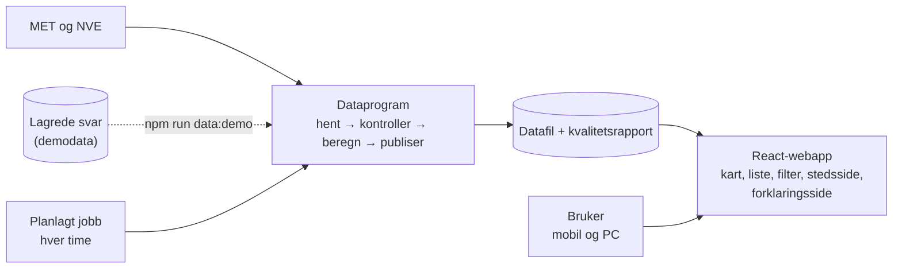

# SnowFinder – Produktbrief

**IBE160 Programmering med KI | Gruppe G18**

*Finn de beste prognostiserte forholdene – før alle andre.*

> **Gjeldende versjon** er `project-phase-folders/1-Oppstartsfasen/SnowFinder-Produktbrief.md`.
> Kopien i `project-workspace/planning-artifacts/product-brief.md` er BMADs arbeidskopi og holdes
> lik. Sist oppdatert 2026-10-07 etter faglærers tilbakemelding
> ([tilbakemelding-product-brief.md](tilbakemelding-product-brief.md)) og to godkjente
> endringsrunder. Den andre runden forenklet løsningen: ingen database, ingen snøvarsel og ingen
> tilbakemeldingsskjema i v1. Tekniske detaljer står i PRD-en og arkitekturen.

## Executive Summary

SnowFinder er en webapp for alle som er ute etter snø. Den finner stedene og tidspunktene med best prognostiserte snøforhold blant stedene i katalogen. Brukeren ser landet fargelagt etter forholdene og filtrerer på egne krav, som «minst 15 mm nysnø og vind under 6 m/s».

Kjernen er **SnowScore**, én forklarbar poengsum fra 0 til 100 som viser snøpotensialet på et sted. Formelen er åpen, og en egen side på nettsiden forklarer steg for steg hvordan den beregnes.

Bak brukeropplevelsen ligger et enkelt dataprogram som henter, kontrollerer og publiserer værdata hver time som én datafil. Nettsiden leser bare den ferdig kontrollerte filen og fungerer videre med siste gyldige data hvis en datakilde faller ut. SnowFinder viser prognostiserte og modellerte forhold, ikke garanterte løypeforhold eller skredsikkerhet.

## The Problem

Den som vil finne snø, må i dag sjekke flere tjenester og selv vurdere om nedbøren blir snø, om det blåser for mye og når på dagen det klarner opp. Informasjonen er fragmentert, og rådataene svarer ikke på hvor og når forholdene er best. Ingen tjeneste vi kjenner lar deg spørre «hvor i Norge oppfylles *alle* kravene mine nå?», med nysnø, vind og temperatur samtidig.

## Target Users

**Skientusiaster** som jakter nysnø og gode skiforhold er den primære målgruppen. **Turentusiaster** som går vinterturer og toppturer, og som vil finne snø med lite vind, er sekundær målgruppe. Tjenesten er åpen for alle, både fastboende og tilreisende.

- *Som skientusiast vil jeg finne alle skisteder med minst 15 mm nysnø neste døgn, slik at jeg kan velge sted for helgen.*
- *Som turgåer vil jeg finne topper med nysnø og vind under 6 m/s, slik at jeg får en god vintertur.*
- *Som skientusiast vil jeg dele et søk med kjøreselskapet med én lenke, slik at vi ser de samme stedene.*

## The Solution

### Norgeskartet

Startsiden er et kart over Norge der alle steder i katalogen er fargelagt etter SnowScore, fra grått for lite snøpotensial til sterkt blått for de beste stedene. Et trykk på et sted åpner stedssiden. En likeverdig listevisning gir samme informasjon uten kart, for tastatur og skjermleser.

### Stedssiden

Hvert sted har en egen side med unik adresse som viser poengsum med delpoeng, temperatur, nysnø, vind, skydekke, høyde og datakildens tidsstempel.

Som «bør ha» viser siden også **beste skivindu**: de fire sammenhengende dagslystimene de neste 48 timene uten nedbør, med lavest snittvind og minst skydekke.
- Kommer det nysnø i perioden, velges bare vinduer etter at snøfallet har stoppet, for eksempel «Best i morgen kl. 09–13, etter nattens snøfall».
- Har stedet ingen dagslystimer i hele 48-timersvinduet (mørketid i Nord-Norge om vinteren), velges vinduet blant alle timene, og siden merkes tydelig med «Mørketid – vindu vist uten dagslys».

### Filter

Filteret gjennomsøker hele stedskatalogen og viser bare steder som oppfyller alle krav.

| **Filter** | **Innstilling** | **Datagrunnlag** |
|---|---|---|
| Nysnø | Minimum i mm vannekvivalent, med anslag i cm | Neste 24/48 t: MET. Siste 24 t (bør ha): NVE seNorge |
| Vind | Maks middelvind og vindkast (m/s) | MET |
| Temperatur | Min- og maksverdi (°C) | MET, korrigert for stedets høyde |
| Sol (bør ha) | Maks skydekke i dagslystimer (%) | MET |
| Avstand (bør ha) | Maks avstand fra brukerens posisjon (km) | Posisjon i nettleseren, lagres aldri |
| Stedstype (bør ha) | Skisted, fjelltopp, by | Stedskatalog |

Filtreringen skjer direkte i nettleseren på de rundt 300 stedene og tar brøkdelen av et sekund. Antall treff oppdateres mens glidebryterne justeres, og ved null treff foreslås hvilket krav som bør lempes. Filterverdiene lagres i nettadressen, slik at søk kan deles med en enkel lenke. Hurtigvalg som «Pudderdag» er «bør ha». Nysnøfilterets cm-anslag bruker samme faste omregning som SnowScore: 1 mm vannekvivalent ≈ 1 cm nysnø.

### Siden «Slik beregner vi SnowScore»

En egen side forklarer SnowScore slik at hvem som helst kan forstå og etterprøve den:

1. **Kort fortalt:** hva SnowScore måler, og hva den ikke måler, i tre setninger.
2. **Steg for steg:** hvordan nedbør og temperatur blir til snøandel, nysnø og de tre delpoengene, med formelen og en illustrasjon av hver del.
3. **Regneeksempel:** et komplett eksempel fra rådata til ferdig poengsum.
4. **Datakilder, begrensninger og datakvalitet:** hvor dataene kommer fra, hvorfor dette er prognoser og ikke målt snø, og hvor god siste datakjøring var.
5. **Endringslogg:** versjonsnummer og begrunnelse for alle justeringer av parameterne.
6. **Prøv selv (bør ha):** en kalkulator der brukeren justerer nedbør og temperatur og ser poengsummen endre seg umiddelbart.

Kalkulatoren og dataprogrammet bruker nøyaktig samme beregningsmodul, slik at forklaringen og poengsummene aldri kan sprike fra hverandre. Hver SnowScore i løsningen lenker til siden.

### Lokal kjøring og demodata

Hvem som helst, også sensor, kan klone repoet og starte SnowFinder med `npm ci && npm run dev`. Det krever ingen nøkler, kontoer eller tilgang til gruppas tjenester.
- Uten videre vises et **demodatasett**. Det er bygget av samme dataprogram fra lagrede svar fra MET og NVE, og viser også tilstander som «ufullstendige data» og utdaterte data. Demomodus er tydelig merket.
- Med `npm run data` henter dataprogrammet **ferske, ekte data** fra MET og NVE på maskinen. Det krever ingen nøkkel.

### Innebygd kvalitetssikring

- **Egenskapsbaserte tester** av SnowScore med minst 1 000 tilfeldige inndata, som bekrefter at poengsummen alltid ligger mellom 0 og 100, at mer snø aldri gir lavere nysnøpoeng, at lavere temperatur aldri gir lavere kuldepoeng, og at samme inndata alltid gir samme resultat.
- **Fasittabeller** for regneeksempelet og filteret (og for skivinduet når det bygges), som både dokumenterer og tester reglene.
- **Kontraktstester** mot lagrede API-svar fra MET og NVE.
- **End-to-end-test** av kart → filter → stedsside, kjørt i demomodus i CI.
- **Automatisk tilgjengelighetssjekk** av filter, liste, stedsside og forklaringsside.
- **Manuell kontroll** av et fast utvalg steder mot MET, og test på mobil og PC.
- **Oppgavebasert brukertest** med minst fem personer, som måler om de klarer å finne et aktuelt sted, justere filteret, forklare en SnowScore, oppdage utdaterte data og skille prognose fra faktiske forhold.
- **Sperret hovedgren:** kode flettes bare inn via Pull Request med grønne tester.

## What Makes This Different

Det finnes allerede gode tjenester. Hver av dem svarer på et annet spørsmål enn SnowFinder:

| **Tjeneste** | **Hva den gir** | **Hva den ikke gir** |
|---|---|---|
| [yr.no](https://www.yr.no) | Prognose for ett sted om gangen | Sammenligning av mange steder mot brukerens egne krav |
| [seNorge.no](https://www.senorge.no) (NVE) | Simulert snø og prognose for nysnø i hele landet, som rasterkart | Filter på flere krav samtidig (nysnø *og* vind *og* temperatur) og forklart poengsum per sted |
| [fnugg.no](https://www.fnugg.no) og [skiinfo.no](https://www.skiinfo.no) | Rapporter og forhold fra alpinanlegg | Steder utenfor anleggene (topper, langrenn), og felles, etterprøvbar vurdering på tvers |

SnowFinder skiller seg ut på tre punkter:
1. **Søk på egne krav på tvers av landet.** Filteret gir bare stedene som oppfyller alle kravene samtidig.
2. **Én åpen poengsum.** SnowScore er en åpen og etterprøvbar formel med delpoeng og regneeksempel.
3. **Ærlig om datakvaliteten.** Appen viser alder og kvalitet på dataene.

SnowFinder bruker selv data fra MET og NVE og erstatter ingen av dem. Den sammenstiller dataene for et konkret spørsmål.

## Scope for Version 1

Prioriteringen følger **MoSCoW-metoden**: Must have, Should have og Won't have.

| **Prioritet (MoSCoW)** | **Funksjoner** |
|---|---|
| Må ha (Must have) | Lokal kjøring med demodata, Norgeskart, tilgjengelig listevisning, stedssider, stedskatalog, dataprogram som henter, kontrollerer og publiserer data hver time med kvalitetsrapport, SnowScore med forklaringsside, filter for nysnø (prognose), vind og temperatur, siste gyldige data ved nedetid, CI med tester |
| Bør ha (Should have) | Beste skivindu, kalkulator på forklaringssiden, solfilter, avstandsfilter, stedstypefilter, nysnø siste 24 t, hurtigvalg, nye forsøk ved feilende kall |
| Ikke i v1 (Won't have) | Snøvarsel med push-varsler, installerbar app (PWA), tilbakemeldingsskjema, database, analyse av treffsikkerhet over tid, brukerkontoer, flere språk, webkameraer, app i appbutikkene, skredvarsling, målt snødybde, booking, generativ værchat |

Versjon 1 er prosjektets **MVP** (minimum viable product). Kjeden stedskatalog → data → SnowScore → kart/liste → stedsside → filter skal virke stabilt før noe annet bygges.

**Hvorfor snøvarsel, tilbakemelding og database er tatt ut:** de krevde fire eksterne tjenester (Supabase, Web Push, Cloudflare Turnstile og en push-leverandør) med nøkler, kontoer og mye oppsett utenfor koden. Faglæreren pekte på at dette øker vanskelighetsgraden mest, og at sensor ikke kan teste det. Uten dem har løsningen ingen skriving fra brukere og ingen lagrede personopplysninger. Med rundt 300 steder er én datafil nok, og en database trengs ikke. Snøvarsel er det naturlige neste steget etter v1.

## Data Sources and Pipeline

| **Kilde** | **Bruk** |
|---|---|
| MET Norway Locationforecast | Timesprognose for nedbør, temperatur, vind og skydekke |
| NVE GridTimeSeries (seNorge) | Modellert nysnø siste døgn |
| Kartverket | Stedsnavn, koordinater og høyde, og topografisk bakgrunnskart |
| OpenStreetMap | Skianlegg (stedskatalogen) |

Alle kilder krediteres i tråd med lisensene sine (CC BY 4.0, NLOD og ODbL), synlig i kartet og på forklaringssiden.

**Stedskatalogen** bygges én gang fra OpenStreetMap (skianlegg og langrennsarenaer), Kartverket (navngitte fjelltopper og tettsteder) og en manuelt kvalitetssikret liste. Den lagres som en fil i repoet. Versjon 1 starter med ca. 300 nøye utvalgte steder.

**Dataprogrammet** kjøres hver time av en planlagt jobb, og kan også kjøres lokalt med `npm run data`:
1. Det henter prognoser for stedene, og respekterer METs vilkår (identifiserende User-Agent, begrenset antall samtidige kall).
2. Hvert svar kontrolleres mot et strengt skjema. Ugyldige svar avvises og logges, og de rettes aldri automatisk.
3. SnowScore beregnes.
4. Resultatet publiseres som én datafil bare hvis minst 95 % av stedene har gyldige data fra MET (NVE-nysnø er tilleggsdata). Ellers beholdes forrige versjon.

Hver kjøring skriver en kort kvalitetsrapport: andel gyldige steder, avviste svar og manglende timer. Hver publisert poengsum kan spores tilbake til kjøringen og kildedataenes tidspunkt. Den planlagte jobben publiserer datafilen til nettsiden uten å lage commits i repoet. En feilet kjøring vises i Actions-fanen i GitHub, med kvalitetsrapporten som vedlegg.

## SnowScore

For et tidsvindu med timesverdier for nedbør *pₕ* (mm) og temperatur *Tₕ* (°C):

```
Snøandel per time:   f(T) = min(1, max(0, (2 − T) / 2))
Nysnø (mm vann):     S = Σ pₕ · f(Tₕ)
Total nedbør:        P = Σ pₕ
Snittemperatur:      T̄ = gjennomsnitt av Tₕ

A  Nysnøpotensial  = 60 · min(1, S / 20)
B  Kuldebonus      = 25 · min(1, max(0, (2 − T̄) / 16))   (0 hvis P < 0,5 mm)
C  Snøandel        = 15 · S / P                             (0 hvis P < 0,5 mm)

SnowScore = round(A + B + C)
```

All nedbør under 0 °C regnes som snø, ingen over +2 °C, og andelen faller lineært mellom. Nysnøpoengene er fulle ved 20 mm vannekvivalent, omtrent 20 cm nysnø — vi bruker en fast omregning på 1 mm vannekvivalent ≈ 1 cm nysnø overalt i løsningen der cm vises; en forenkling av faktisk snøtetthet, men holdt likt ett sted i koden slik at tallene aldri spriker.

Kuldebonusen (B) krever nedbør for å telle: er det ikke nedbør i vinduet (P < 0,5 mm), er B og C alltid 0 uansett temperatur. En kald og tørr dag skal ikke score høyt bare fordi temperaturen er lav — SnowScore skal reflektere snøpotensial, ikke vintertemperatur alene. Nevneren i B (16, mot tidligere 6) er valgt slik at kuldebonusen først når full poengsum ved omtrent −14 °C i snitt i stedet for allerede ved −4 °C, slik at B faktisk skiller mellom «akkurat kaldt nok» og «arktisk kaldt» i stedet for at nesten alle norske vintersteder får makspoeng.

**Eksempel:** Et 6-timers vindu har disse timesverdiene:

| Time | Nedbør *pₕ* (mm) | Temperatur *Tₕ* (°C) |
|---|---|---|
| 1 | 1 | −1 |
| 2 | 3 | −3 |
| 3 | 4 | −4 |
| 4 | 3 | −3 |
| 5 | 1 | −2 |
| 6 | 0 | −1 |

P = 12 mm. Alle nedbørstimer har T ≤ 0 °C, så f(Tₕ) = 1 for hver av dem og S = 12 mm. T̄ = (−1−3−4−3−2−1) / 6 = −2,3 °C.

A = 60 · min(1, 12/20) = 36
B = 25 · min(1, max(0, (2 − (−2,3)) / 16)) = 25 · 0,27 ≈ 7
C = 15 · 12/12 = 15

SnowScore = round(36 + 7 + 15) = **58**

Mangler mer enn 10 % av timene, vises «ufullstendige data» i stedet for en poengsum, og alle parametere er versjonert i forklaringssidens endringslogg.

## Robustness and Security

- **Frakoblet arkitektur:** nettsiden leser bare den publiserte datafilen. Faller MET ut, fungerer SnowFinder videre med siste gyldige data. Faller NVE ut, publiseres dataene uten NVE-nysnø, som ikke inngår i SnowScore.
- **Ærlig alder på data:** data eldre enn tre timer merkes «utdatert», og steder med data eldre enn tolv timer tas ut av kart og filter.
- **Kvalitetsterskel:** en kjøring publiseres bare når minst 95 % av stedene har gyldige data fra MET, og to kjøringer kan ikke publisere samtidig.
- **Ingen skriving og ingen hemmeligheter:** brukere sender ingen data til SnowFinder, og verken nettsiden eller dataprogrammet trenger nøkler. Det fjerner hele kategorien av angrep mot skjemaer og databaser.
- **Overvåking:** hver kjøring lager en kvalitetsrapport, og feilede kjøringer er synlige i GitHub Actions, som gruppa sjekker fast.
- **Nye forsøk ved feil (bør ha):** kontrollert ventetid før et feilende kall prøves igjen.

## Proposed Architecture

Overordnet bilde. Komponenter og regler står i [arkitekturen](../2-Planleggingsfasen/SnowFinder-Arkitektur.md).



| **Område** | **Teknologi** |
|---|---|
| Nettside | React, TypeScript og Vite, publisert som statisk side |
| Kart | Leaflet med Kartverkets topografiske kart (endret fra OpenStreetMap 2026-10-08) |
| Dataprogram | Node.js-script i samme kodebase, med samme beregningsmodul som nettsiden |
| Validering | Zod |
| Data | Én JSON-datafil med kvalitetsrapport, ingen database |
| Tid og sol | date-fns-tz og SunCalc |
| Testing | Vitest, fast-check og Playwright |
| Automatisering og publisering | GitHub Actions (CI og planlagt jobb) og GitHub Pages |

## Privacy

SnowFinder har ingen brukerkonto, ingen skjema og ingen database. Løsningen lagrer ingen opplysninger om brukerne. Posisjonen brukes bare i nettleseren til avstandsfilteret og sendes aldri noe sted. Den eneste identifikatoren som håndteres, er IP-adressen som enhver statisk nettside nødvendigvis ser hos vertstjenesten.

## Risks and Mitigations

| **Risiko** | **Tiltak** |
|---|---|
| Datakilde endrer format eller er nede | Kontraktstester, skjemakontroll og siste gyldige data |
| For mange kall mot MET | Identifiserende User-Agent, begrenset samtidighet og avrundede koordinater |
| SnowScore oppleves som misvisende | Åpne formler, synlige delpoeng, fasittabeller og kalibrering mot manuelle kontroller |
| Den planlagte jobben stopper | Siste gyldige data vises med tydelig alder. Feilede kjøringer er synlige i GitHub Actions, og jobben kan startes på nytt for hånd |
| Scopet vokser | Prioriteringstabellen styrer rekkefølgen, og «bør ha» bygges først når «må ha» er ferdig |

## Success Criteria

Kriteriene er delt etter hvordan de verifiseres, slik at det er tydelig hva som faktisk er sjekket.

| **Område** | **Målbart kriterium** | **Verifiseres** |
|---|---|---|
| Kjerneflyt | En bruker kan åpne kartet, sette et filter og åpne en stedsside fra resultatet, også i demomodus | Automatisk (E2E i CI) |
| Korrekthet | Egenskapstestene for SnowScore passerer for minst 1 000 tilfeldige inndata, og fasittabellene for regneeksempel og filter stemmer | Automatisk (CI) |
| Robusthet | Tjenesten viser siste gyldige data når en datakilde simuleres nede | Automatisk (CI) |
| Datakvalitet | Hver kjøring lagrer en kvalitetsrapport, og hver publisert verdi kan spores til kjøringen | Automatisk (CI) |
| Tilgjengelighet | Filter, stedssider, forklaringsside og listevisning har null kritiske WCAG 2.1 AA-brudd i automatisk sjekk. Selve kartlaget er unntatt; listevisningen er det fulle alternativet | Automatisk (CI) |
| Sporbarhet | Alle endringer i hovedgrenen kommer via Pull Requests | Git-historikken |
| Kjørbarhet | Et gruppemedlem starter appen fra et rent klon kun etter README, på under 10 minutter | Manuelt, tidlig og før hver innlevering |
| Ytelse | Filteret svarer på under 2 sekunder, og kartet er interaktivt innen 3 sekunder på mobil | Manuelt, med måledata |
| Ferskhet | Publiserte data er normalt under 90 minutter gamle | Manuelt, fra kvalitetsrapportene i drift |
| Nytte | Minst 4 av 5 testbrukere fullfører oppgaven «finn et skisted som oppfyller et gitt krav, f.eks. minst 15 mm nysnø og vind under 6 m/s» på under 2 minutter, uten hjelp fra testleder | Brukertest |
| Dataforståelse | Minst 4 av 5 testbrukere skiller prognose fra faktiske forhold og oppdager utdaterte data | Brukertest |
| Forklarbarhet | Minst 4 av 5 testbrukere kan forklare en vist SnowScore etter å ha lest forklaringssiden | Brukertest |

Antall tilfeldige inndata er satt ned fra 10 000 til 1 000 (PRD SM-6), slik at CI holder en rimelig kjøretid. Egenskapene som testes er de samme.

## AI-assisted Development

Dataprogrammet og poengberegningene er deterministisk kode, slik at resultatene kan testes og etterprøves. KI brukes der den gir størst verdi: BMad-agenter i planleggingen og Claude Code til kodeutkast, tester, feilsøking og dokumentasjon. Gruppen fører logg over sentrale prompts, hvilke forslag som ble endret eller avvist, og hvem som godkjente endringen. KI-generert kode går gjennom samme tester og godkjenning som all annen kode.

## Ethical Considerations

SnowScore og filteret påvirker valg, men er ingen sikkerhetsvurdering, og løsningen lover aldri snø eller trygg ferdsel. Usikkerhet og datakilde vises alltid, og stedssider for fjellområder lenker til Varsom.no. Personvernet er ivaretatt ved at løsningen ikke samler inn opplysninger om brukerne i det hele tatt.

## Product Vision

SnowFinder skal bli det naturlige stedet å starte når man leter etter snø i Norge. Etter v1 kommer i denne rekkefølgen:
1. **Snøvarsel** med push-varsel når et fulgt sted oppfyller brukerens krav.
2. **Direktevideo fra offentlig tilgjengelige webkameraer.** Søker brukeren på Trysil skisenter, vises livebildet ved siden av prognosen dersom eieren har publisert et kamera. Dette bygges kun på kameraer eieren selv har gjort offentlige, i tråd med deres vilkår og med egen personvernvurdering.
3. **En tidslinje** som viser forholdene time for time over hele landet.
4. **En treffsikkerhetsmåler** som viser hvor godt tidligere prognoser traff.

## Development Process

Prosjektet følger BMad Method med korte iterasjoner i prioritert rekkefølge: stedskatalog og dataprogram, SnowScore, kart og stedssider, filter, deretter «bør ha»-funksjonene. Hvert medlem arbeider på egen branch, og alle endringer går gjennom Pull Request med tester og KI-gjennomgang.

Hver Pull Request bygges og testes automatisk i CI med demodata, uten eksterne tjenester. Stedskatalogen og demodataene ligger som versjonerte filer i repoet.

## Definition of Done

- Appen kan startes fra et rent klon kun etter README, i demomodus og uten nøkler.
- Alle «må ha»-funksjoner er implementert, testet og dokumentert.
- SnowScore følger publisert formel og består egenskapstestene.
- Forklaringssiden er publisert og bruker samme beregningsmodul som dataprogrammet.
- Filteret gir korrekte treff på tvers av stedskatalogen innenfor ytelseskravet.
- Tjenesten fungerer med siste gyldige data når en datakilde er nede.
- Alle tester i CI er grønne.
- KI-bidrag og menneskelig kvalitetssikring er dokumentert.
