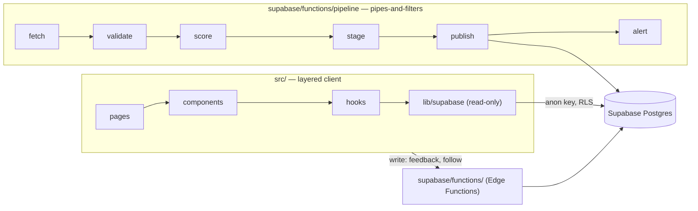
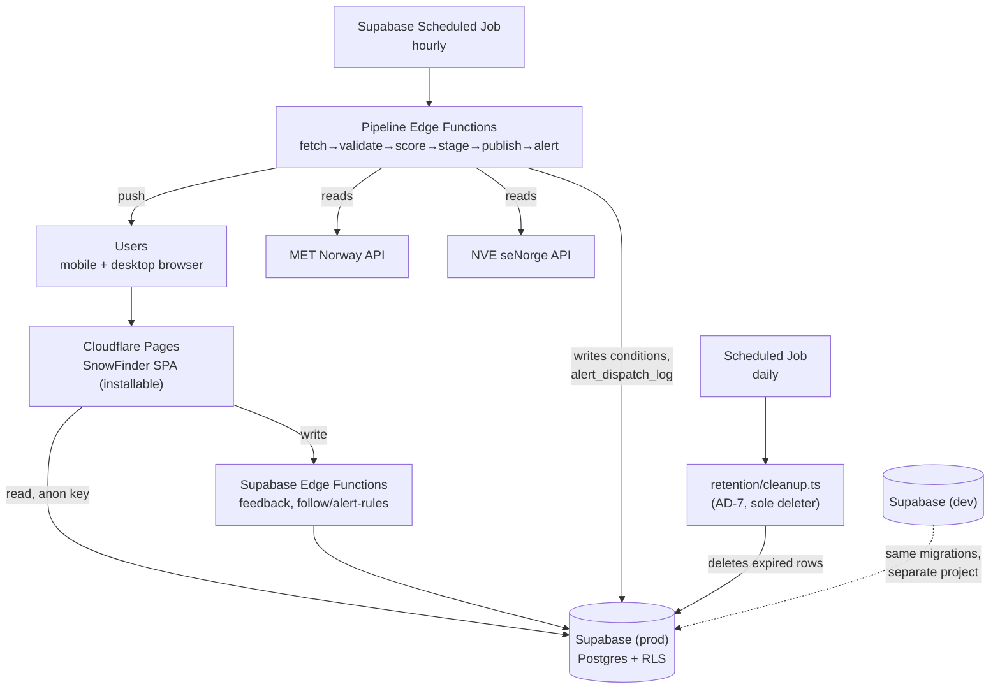

# Architecture Spine — SnowFinder

## Design Paradigm

Two paradigms, cleanly separated by directory:

- **Backend (`supabase/`): Pipes-and-Filters.** The hourly job is a chain of independent
  stages — fetch → schema-validate → score → stage → publish (atomic, ≥95% valid) → alert —
  exactly as specified in the product brief. Each stage is one file; each only reads the
  previous stage's output shape and writes its own.
- **Frontend (`src/`): thin layered client, read-only against the database.** Pages →
  components → hooks → `lib/supabase` (read queries only). The client never *writes* the
  authoritative published SnowScore — that's the pipeline's job (AD-1) — and never holds a
  service-role key. It *does* compute SnowScore locally, for the explainer page's "prøv
  selv" calculator, using the exact same shared module the pipeline uses (AD-6) — never a
  second copy of the formula.



## Invariants & Rules

### AD-1 — Client is read-only against the database; each table has exactly one writer

- **Binds:** `src/**`, `supabase/functions/**`
- **Prevents:** a component bypassing Row Level Security, a service-role key ending up in
  the frontend bundle, or two Edge Functions racing on the same table (e.g. `follow/`
  registering a rule while `alert.ts` also mutates it).
- **Rule:** `src/` may only reach Supabase through `src/lib/supabase/client.ts`, using the
  anon key, for `select` queries on RLS-scoped tables. Every write goes through an Edge
  Function, and each table has exactly one writer: `alert_rules` is written only by
  `supabase/functions/follow/`; `feedback` only by `supabase/functions/feedback/`;
  `pipeline/alert.ts` never writes to `alert_rules` — it writes dedup/last-notified state to
  its own `alert_dispatch_log` table instead. No other file constructs a Supabase client.

### AD-2 — Pipeline stages are independent files with one staging contract

- **Binds:** `supabase/functions/pipeline/**`, `supabase/migrations/**`
- **Prevents:** two stages (e.g. `fetch` and `validate`) independently assuming different
  shapes for the staging row — one writing typed columns, another writing a raw JSON
  blob — and silently diverging.
- **Rule:** each pipeline stage (`fetch`, `validate`, `score`, `stage`, `publish`, `alert`)
  is its own file under `supabase/functions/pipeline/`, is idempotent (same input → same
  output, safe to re-run), and only *appends* typed columns to the single migration that
  defines `conditions_staging` — no stage introduces a parallel `raw_payload`/`jsonb` shape
  or a second staging table. One scheduled entrypoint orchestrates the chain in order.

### AD-3 — Two Supabase environments, migrations as the only schema change path

- **Binds:** `supabase/migrations/**`, CI
- **Prevents:** dev and prod schemas drifting, or a hand-edited prod table nobody can
  reproduce.
- **Rule:** dev and prod are separate Supabase projects. `supabase/migrations/*.sql` is the
  only way the schema changes. CI applies migrations to dev on every PR and to prod only
  after merge to `main`.

### AD-4 — Unit/property tests colocated, E2E and contract tests separated

- **Binds:** all test code
- **Prevents:** contributors putting the same kind of test in different places, or a
  Playwright run needing the Vitest runtime (or vice versa).
- **Rule:** Vitest + fast-check tests live as `*.test.ts` next to the file they test
  (`src/**` and `supabase/functions/**`). Playwright E2E specs live under `tests/e2e/`.
  Contract tests against recorded MET/NVE responses live under `tests/contract/`, fixtures
  in `tests/contract/fixtures/`.

### AD-5 — Catalog build is offline; `locations` is read-only at runtime

- **Binds:** `scripts/build-catalog/**`, `supabase/functions/pipeline/**`
- **Prevents:** `src/` or `supabase/functions/` importing OSM/Kartverket-fetching code at
  request time (reintroducing the fragile third-party dependency the pipeline's circuit
  breakers exist to avoid), and `publish.ts` silently upserting new locations from
  MET/NVE coordinates instead of going through catalog review.
- **Rule:** the stedskatalog build (OpenStreetMap + Kartverket → ~300 seed locations) is a
  manually-run script under `scripts/build-catalog/` that only ever *produces* a
  `supabase/migrations/` seed file. `locations` is migration-seeded and read-only at
  runtime: no pipeline stage or Edge Function may `INSERT`/`UPDATE`/`DELETE` it. Nothing
  under `src/` or `supabase/functions/` imports the build script.

### AD-6 — One scoring module, shared by name across both runtimes

- **Binds:** `shared/snowscore.ts`, `src/lib/snowscore.ts`, `supabase/functions/pipeline/score.ts`
- **Prevents:** the calculator (browser) and the pipeline (Deno Edge Function) each shipping
  their own copy of the SnowScore formula and drifting apart — the brief is explicit this
  must never happen.
- **Rule:** `shared/snowscore.ts` is the single canonical implementation: pure TypeScript,
  zero dependencies on React, npm packages, or Deno/Node/browser globals, so it runs
  unmodified under both Vite and Deno. `src/lib/snowscore.ts` and
  `supabase/functions/pipeline/score.ts` both import it by relative path — neither
  reimplements or copies the formula. A parity test runs a fixed golden input set through
  both import paths and asserts identical output.

### AD-7 — Retention deletions have one owner

- **Binds:** `supabase/functions/retention/**`
- **Prevents:** two different functions independently deleting from the same table on
  different schedules, or a TTL rule from the brief (24h rate-limit hash, 12-month feedback,
  7-day weather data) being implemented nowhere at all.
- **Rule:** a single scheduled function, `supabase/functions/retention/cleanup.ts`, owns
  every TTL deletion in the brief. No other Edge Function or pipeline stage deletes rows
  from `feedback`, the rate-limit hash table, or historical weather data.

## Consistency Conventions

| Concern | Convention |
| --- | --- |
| Naming (files, tables, functions) | `snake_case` for SQL (tables, columns, RPC functions); `camelCase` for TS values, `PascalCase` for React components/types. Pipeline stage files named after the stage verb (`fetch.ts`, `validate.ts`, …). |
| Data & formats | All timestamps stored in UTC (`timestamptz`), converted to Norwegian local time only at the UI edge. IDs are Postgres `uuid`. API error shape: `{ error: { code, message } }` from every Edge Function. |
| State & cross-cutting | Secrets only as Supabase project env vars, never committed, never in `src/`. All Edge Functions validate input with Zod before touching the database. Pipeline failures, rejected responses, and circuit-breaker trips both write to `api_incidents` *and* call a team-notification path (e.g. a webhook) — logging alone is not enough. |
| Comments | No comments for what the code already says through naming — don't restate the obvious. Write one only for the *why*: a non-obvious constraint, a workaround for a specific API quirk (e.g. MET's `Expires` header behavior), or a rule this spine binds (e.g. `// AD-1: alert.ts never writes alert_rules`). If a reviewer would ask "why is this here?", that's the comment to write. |

## Stack

| Name | Version |
| --- | --- |
| Node.js | 24 LTS ("Krypton") |
| React | 19.3.0 |
| TypeScript | 6.0.x (last JS-based compiler line; 7.0's Go-native rewrite shipped stable July 2026, but its IDE/tooling ecosystem is still maturing — [ASSUMPTION] stay on 6.0.x for this course project, revisit for v2) |
| Vite | 8.3.0 |
| @supabase/supabase-js | 2.116.0 |
| Leaflet | 1.9.4 (stable; 2.0 is alpha-only, not used) |
| Zod | 4.6.5 |
| Vitest | 5.0.1 |
| fast-check | 4.10.1 |
| Playwright | 1.63.0 |
| date-fns-tz, SunCalc | latest at install time (pinned in `package-lock.json`) |
| Package manager | npm (single package at repo root; no monorepo tool — Edge Functions are separate Deno scripts, not part of the npm workspace) |
| Hosting | [ASSUMPTION] Cloudflare Pages for the frontend (same provider as the already-chosen Cloudflare Turnstile); Vercel is an equally valid alternative — confirm with the group |

## Structural Seed



```text
/
  src/                          # frontend — layered, read-only against Supabase
    pages/                      # route-level views: map, location page, score-explainer, feedback
    components/                 # shared presentational components
    hooks/                      # data-fetching + derived-state hooks
    lib/
      supabase/                 # client.ts (anon key, read queries only)
      snowscore.ts              # re-exports shared/snowscore.ts for the calculator UI (AD-6)
      types/                    # shared TS types generated from the DB schema
    *.test.ts                   # colocated Vitest + fast-check tests
  shared/
    snowscore.ts                # single canonical SnowScore formula (AD-6) — pure TS,
                                 #   no React/npm/Deno-specific deps, imported by BOTH
                                 #   src/lib/snowscore.ts and
                                 #   supabase/functions/pipeline/score.ts
  supabase/
    migrations/                 # versioned SQL — the only schema change path (AD-3)
    functions/
      pipeline/                 # fetch.ts, validate.ts, score.ts, stage.ts, publish.ts, alert.ts (AD-2)
                                 #   alert.ts writes only to alert_dispatch_log, never alert_rules (AD-1)
      feedback/                 # Turnstile-verified feedback submission (write path)
      follow/                   # alert-rule registration; sole writer of alert_rules (AD-1)
      retention/
        cleanup.ts               # sole deleter of expired feedback/hash/weather rows (AD-7)
  scripts/
    build-catalog/              # one-off: OSM + Kartverket -> migrations/seed (AD-5)
  tests/
    e2e/                        # Playwright, against a preview deploy
    contract/
      fixtures/                 # recorded MET/NVE responses
  project-phase-folders/         # course documentation (see project-phase-folders/README.md)
  .github/
    workflows/                  # ci.yml, e2e.yml, deploy.yml
    agents/                     # existing BMAD agent configs — unrelated to CI
  .agents/, .claude/, _bmad/    # BMAD tooling (unchanged by this spine)
```

## Deferred

- **Mobile-native app, webcam livestream, i18n, catalog scale-out to ~1500 locations, real
  vector-field wind animation** — already explicitly out of v1 scope in the product brief;
  not re-decided here. Revisit if/when a v2 brief exists.
- **Push-notification delivery path** — brief specifies "Web Push" but not a provider
  (raw Web Push API vs. a service). Left for the story implementing snøvarsel.
- **Exact CI test-matrix/caching strategy** — `AD` above fixes *where* each test type lives
  and *that* CI runs them; tuning job parallelism/caching is an implementation detail for
  `.github/workflows/ci.yml`, not an architectural invariant.
