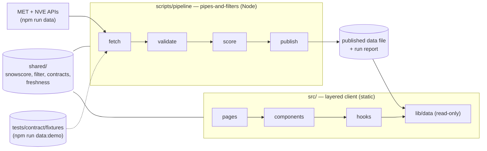
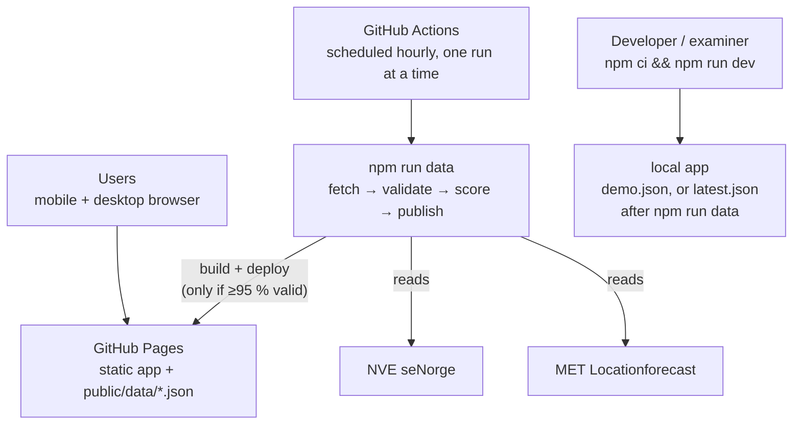

# Architecture Spine — SnowFinder

**v4 (2026-10-07), simplification.** This version follows PRD v3 and the second approved change
proposal
([sprint-change-proposal-2026-10-07-forenkling.md](../../project-workspace/planning-artifacts/sprint-change-proposal-2026-10-07-forenkling.md)),
which acted on the course teacher's advice to cut the parts that cost the most to set up.

What changed:
- **No database and no Supabase.** The data program is a Node script that publishes one JSON
  data file. The app is static files that filter in the browser.
- **No user writes in v1.** Snow alerts, Web Push, the PWA and the feedback form are out of
  scope, and so is everything they needed (Edge Functions, RLS, Turnstile, rate limits and
  retention jobs).
- **AD changes.** AD-3 and AD-7 are retired, and their IDs are never reused. AD-1, AD-2, AD-5,
  AD-10, AD-11 and AD-12 are rewritten for the file-based design. AD-4, AD-6, AD-8 and AD-9 keep
  their intent.

The full trail is in `.memlog.md` in this folder (v1 2026-09-22, v2 2026-09-27, v3 and v4
2026-10-07).

## Design Paradigm

Two paradigms, separated by directory:

- **Data program (`scripts/pipeline/`): Pipes-and-Filters.** One run is a chain of independent
  stages: fetch → validate → score → publish. A publish happens only if at least 95 % of
  locations are valid, and it is atomic. Each stage is one file that reads the previous stage's
  output shape and adds its own. The same program runs on recorded fixtures (demo) or on the
  live MET and NVE APIs.
- **App (`src/`): thin layered client, read-only.** Pages → components → hooks → `lib/data`,
  which loads the published data file. The app never writes anything anywhere. It filters and
  computes SnowScore (for the explainer calculator) with the same `shared/` modules the data
  program uses (AD-6).


```mermaid
flowchart LR
    subgraph PIPE["scripts/pipeline — pipes-and-filters (Node)"]
        F[fetch] --> V[validate] --> S[score] --> PB[publish]
    end
    SRC["MET + NVE APIs<br/>(npm run data)"] --> F
    FIX[("tests/contract/fixtures<br/>(npm run data:demo)")] -.-> F
    PB --> FILE[("published data file<br/>+ run report")]
    subgraph FE["src/ — layered client (static)"]
        P[pages] --> C[components] --> H[hooks] --> L["lib/data (read-only)"]
    end
    FILE --> L
    SH[("shared/<br/>snowscore, filter, contracts,<br/>freshness")] --- PIPE
    SH --- FE
```

## Invariants & Rules

### AD-1 — The app only reads the published data file; each data file has exactly one writer *(rewritten v4)*

- **Binds:** `src/**`, `scripts/**`, `public/data/**`
- **Prevents:** the app growing a hidden write path or a secret, and two scripts writing the
  same data file with different shapes.
- **Rule:**
  - `src/` loads data only through `src/lib/data/` with plain `fetch` of static JSON. It writes
    nothing, sends nothing except normal page and file requests, and holds no keys.
  - Each data file has one writer, listed in *Data Files and Owners*.
  - No file in the repository contains a secret, and v1 needs none: MET requires only an
    identifying User-Agent.

### AD-2 — Pipeline stages are independent files with one run contract *(rewritten v4)*

- **Binds:** `scripts/pipeline/**`, `shared/contracts/**`
- **Prevents:** two stages assuming different shapes for the data they pass on, and a failed
  run leaving a half-written data file.
- **Rule:**
  - Each stage (`fetch.ts`, `validate.ts`, `score.ts`, `publish.ts`) is its own file under
    `scripts/pipeline/`.
  - Stages are idempotent and pass data forward only through the typed `RunContext`
    (`shared/contracts/run.ts`). No stage writes an intermediate file another stage reads.
  - `run.ts` is the single entrypoint. It creates the run ID, calls the stages in order, and
    always calls `publish.ts`'s run-report step last, in a `finally`, so a failed run still
    records why (AD-11).
  - **Atomic publish.** `publish.ts` writes the new data file to a temporary name and renames it
    into place, and only when at least 95 % of locations are valid. Otherwise the previous file
    stays untouched.
  - **One run at a time.** The scheduled job uses a GitHub Actions `concurrency` group without
    cancellation.
  - **Threshold and partial failures.** The 95 % threshold counts only rejected or missing
    responses; locations with incomplete data count as valid. In a published run, a location
    whose response failed appears as incomplete data without a score. The file never carries
    values from an earlier run.
  - **Simple retries are *Should have* (FR-6b).** v1 makes one attempt per location with capped
    concurrency. There is no circuit breaker, because there is no state between runs.
  - When the Should-have best ski window (FR-17) is built, `score.ts` writes an explicit
    `skivinduUtenDagslys` flag. The app reads it verbatim and never re-derives mørketid.

### AD-3 — *Retired in v4*

- **Binds:** nothing (retired).
- **Prevents:** — (it prevented dev/prod schema drift, and there is no database in v1).
- **Rule:** Retired. It required two Supabase environments and made migrations the only way to
  change the schema. The ID is not reused.

### AD-4 — Unit/property tests colocated; E2E, contract and golden tests separated

- **Binds:** all test code
- **Prevents:** the same kind of test ending up in different places, or a Playwright run
  needing the Vitest runtime (or vice versa).
- **Rule:**
  - Vitest and fast-check tests live as `*.test.ts` next to the file they test (`src/**`,
    `shared/**`, `scripts/**`).
  - Playwright E2E specs live under `tests/e2e/`.
  - Contract tests against recorded MET/NVE responses live under `tests/contract/`, with
    fixtures in `tests/contract/fixtures/`.
  - Golden tables live as JSON under `tests/golden/` (AD-12).

### AD-5 — The catalog is built offline into a versioned file *(rewritten v4)*

- **Binds:** `scripts/build-catalog/**`, `data/catalog.json`, `scripts/pipeline/**`
- **Prevents:** the app or the data program calling OSM or Kartverket for catalog data at run time
  (the app's only run-time map call is Kartverket's topo background tiles, decided 2026-10-08), and the data
  program silently inventing locations from MET coordinates instead of going through catalog
  review.
- **Rule:**
  - `scripts/build-catalog/` is run by hand. It only ever produces `data/catalog.json` (~300
    locations), which is validated against a Zod schema and committed.
  - The data program reads the catalog and never changes it.
  - Nothing outside `scripts/build-catalog/` imports that script.

### AD-6 — Shared domain logic lives once, in `shared/`

- **Binds:** `shared/**`, `src/lib/**`, `scripts/pipeline/**`
- **Prevents:** the app and the data program each carrying their own copy of the formula,
  filter, validation or freshness rules and drifting apart.
- **Rule:**
  - All deterministic domain logic is pure TypeScript in `shared/`, imported by both the app
    (Vite) and the data program (Node):
    - `snowscore.ts`: the formula, the mapping from raw hours to score input, rounding, and the
      incomplete-data rule;
    - `filter.ts`;
    - `freshness.ts`;
    - `contracts/`;
    - `skivindu.ts`, when FR-17 is built.
  - Nothing is reimplemented or copied elsewhere.
  - `zod` is the only third-party import allowed in `shared/`.
  - The data program runs as TypeScript through `tsx`, the single runner, which resolves
    `shared/` imports the same way Vite does. No build step is needed.

### AD-7 — *Retired in v4*

- **Binds:** nothing (retired).
- **Prevents:** — (it prevented two jobs deleting the same rows, and v1 stores no time-limited
  data).
- **Rule:** Retired. It made `retention/cleanup.ts` the only deleter of time-limited rows. The
  ID is not reused.

### AD-8 — Map and list are one route, one data hook *(v2, PRD FR-13/FR-21)*

- **Binds:** `src/pages/Utforsk.tsx`, `src/hooks/useSteder.ts`
- **Prevents:** the map view and the accessible list view being built as two pages with two
  data paths that quietly diverge in which filter parameters they read.
- **Rule:**
  - `Utforsk` is the only route for exploring the catalog.
  - It reads `visning=kart|liste` from the URL (default `kart`) purely to choose
    `KartVisning` or `ListeVisning`.
  - Both views read the same filter parameters (parsed by `shared/filter.ts`, AD-12) and call
    the same `useSteder()` hook.
  - No page fetches or filters location data any other way.

### AD-9 — Design tokens have one source in code *(v2, DESIGN.md)*

- **Binds:** `src/lib/theme.ts`, `src/styles/tokens.css`, every component under `src/components/`
- **Prevents:** components hardcoding DESIGN.md's hex/px values and drifting from the spec.
- **Rule:**
  - `src/lib/theme.ts` is the single source of truth for every DESIGN.md frontmatter token.
  - `src/styles/tokens.css` mirrors those tokens as CSS custom properties, and
    `theme.test.ts` fails CI on drift.
  - Leaflet marker colours import from `theme.ts`.
  - No component writes a literal hex/px value for anything DESIGN.md names.

### AD-10 — One published data file, two sources, no mode switch in the app *(rewritten v4, PRD FR-30)*

- **Binds:** `scripts/pipeline/**`, `public/data/**`, `src/lib/data/**`, `src/lib/clock.ts`
- **Prevents:**
  - demo data that is hand-written or shaped differently from live data;
  - components deciding "demo or live" on their own;
  - data age that depends on when an examiner happens to start the app.
- **Rule:**
  - **Two sources, one program.** `npm run data:demo` runs the data program on
    `tests/contract/fixtures/`, and `npm run data` runs it on the live APIs. Both produce the
    same file shape (AD-12).
  - **Files.** The demo file `public/data/demo.json` is committed. Live output goes to
    `public/data/latest.json`, which is gitignored locally and published by the scheduled job.
    `src/lib/data/` loads `latest.json` and falls back to `demo.json` when it is absent, which is
    the case on a clean clone.
  - **Production never shows demo data.** The site build in `data.yml` fails if the run did
    not produce `latest.json`, so the previous deployment stays live. Every deploy, including
    deploys triggered by code changes, goes through `data.yml` and runs the data program first.
  - **Demo is deterministic.** It uses its own small catalog, fully covered by fixtures. Its
    `referenceTime` is the newest fixture timestamp, its run ID is fixed, and its duration is
    0. Regenerating it gives a byte-identical file.
  - **One mode flag.** The file carries `mode: "demo" | "live"`, and the app reads it only to
    show the demo banner. No environment variable switches behaviour.
  - **One clock.** `src/lib/clock.ts` is the only source of "now" in `src/`: it returns the
    file's `referenceTime` in demo mode and the wall clock in live mode. No other file calls
    `Date.now()` or `new Date()` without arguments, and lint enforces that.
  - **Data age.** Age is `now() − source timestamp`, judged by `shared/freshness.ts`: 3 h means
    stale, 12 h means hidden.

### AD-11 — Every run leaves a quality report; published values are traceable *(rewritten v4, PRD NFR-DQ1–3)*

- **Binds:** `scripts/pipeline/**`, `shared/contracts/**`, `public/data/**`
- **Prevents:** a run failing silently, and published scores that cannot be traced to the run
  and source data behind them.
- **Rule:**
  - **The run report.** `publish.ts` writes one report per run, including failed runs, through
    the `finally` in AD-2. It records start, duration, location count, valid share, rejected
    responses per source (with location, source and reason), locations with incomplete data,
    whether the run was published, and the reason if it was not.
  - **Where reports go.** The report of a published run is embedded in the data file. A run that
    does not publish prints its report to the job log and uploads it as a workflow artifact.
    v1 keeps no history file: the GitHub Actions run list is the history, which keeps the
    scheduled job stateless.
  - **Lineage.** Every published location record carries the run ID and the source timestamp.
  - **The data contract.** MET and NVE Zod schemas live in `shared/contracts/`, documented in
    `shared/contracts/data-dictionary.md` (field, unit, valid range, source).

### AD-12 — Shapes that cross a boundary are Zod schemas in `shared/contracts/` *(simplified v4)*

- **Binds:** `shared/contracts/**`, `shared/filter.ts`, `scripts/pipeline/**`, `src/lib/data/**`,
  `tests/golden/**`
- **Prevents:** the app, the data program and the golden tables each inventing their own field
  names, nullability or filter-parameter format.
- **Rule:**
  - **The data file.** `PublishedData`, `Sted`, `RunReport` and `Catalog` are single Zod
    schemas with camelCase fields. `publish.ts` validates the file against `PublishedData`
    before writing it, and `src/lib/data/` parses it with the same schema when loading.
  - **Filter parameters.** `shared/filter.ts` owns `FilterParams` and the only URL ↔ filter
    `parse` and `serialize` functions.
  - **Golden tables.** They use these shapes (`tests/golden/snowscore.json`, `filter.json`,
    later `skivindu.json`) and state their boundary rules: inclusive or exclusive limits, nulls
    and tie-break order.

## Data Files and Owners *(v4, replaces «Tables and Owners»)*

| File | Writer (only one) | Read by app? | Kept | MoSCoW |
| --- | --- | --- | --- | --- |
| `data/catalog.json` | `scripts/build-catalog/` (by hand, AD-5) | via the data file | versioned in git | Must |
| `public/data/demo.json` | `scripts/pipeline/publish.ts` via `npm run data:demo` | yes, as fallback | versioned in git | Must |
| `public/data/latest.json` | `scripts/pipeline/publish.ts` via `npm run data` | yes | replaced each run; not committed | Must |

## Consistency Conventions

| Concern | Convention |
| --- | --- |
| Naming | camelCase for TS values and JSON fields; PascalCase for React components and types; pipeline stage files named after the stage verb (`fetch.ts`, `validate.ts`, …). |
| Data & formats | All timestamps in UTC (ISO 8601) in data files, converted to Norwegian local time only in the UI. |
| Configuration | No secrets anywhere. The only configurable value is the MET User-Agent contact, which defaults to the group's public contact address in code. `.env.example` lists any optional local overrides with safe defaults. |
| Comments | Comment only the *why*: a non-obvious constraint, an API quirk (e.g. MET's `Expires`), or the AD a line enforces (e.g. `// AD-2: publish only at ≥95 % valid`). |

## Stack

Versions are the pinned project versions, checked against npm on 2026-10-07. Newer patch
releases exist for some packages (e.g. Vite 8.3.3, Vitest 5.0.3); the project stays on its
exact pins and updates them deliberately.

| Name | Version |
| --- | --- |
| Node.js | 24 LTS |
| tsx | runs the data program; exact version pinned by Story 1.3 (at least 7 days old) |
| React | 19.3.0 |
| TypeScript | 6.0.3 |
| Vite | 8.3.0 |
| Leaflet | 1.9.4 |
| Zod | 4.6.5 |
| Vitest | 5.0.1 |
| fast-check | 4.10.1 |
| Playwright | 1.63.0 |
| date-fns-tz, SunCalc | exact versions pinned by the first story that needs them |
| Package manager | npm, single package at the repo root |
| CI, scheduled job and hosting | GitHub Actions and GitHub Pages *[ASSUMPTION — confirm with the group; a repository admin must enable Actions and Pages]* |

## Structural Seed


```mermaid
flowchart TB
    U["Users<br/>mobile + desktop browser"] --> PAGES["GitHub Pages<br/>static app + public/data/*.json"]
    CRON["GitHub Actions<br/>scheduled hourly, one run at a time"] --> RUN["npm run data<br/>fetch → validate → score → publish"]
    RUN -- "reads" --> MET["MET Locationforecast"]
    RUN -- "reads" --> NVE["NVE seNorge"]
    RUN -- "build + deploy<br/>(only if ≥95 % valid)" --> PAGES
    DEV["Developer / examiner<br/>npm ci && npm run dev"] --> LOCAL["local app<br/>demo.json, or latest.json<br/>after npm run data"]
```

```text
/
  src/                          # app — layered, read-only, static
    pages/
      Utforsk.tsx               #   kart+liste, ONE route (AD-8)
      Sted.tsx                  #   location page
      SlikBeregnerViSnowScore.tsx #  explainer + data-quality panel (+ calculator: Should)
    components/                 # KartVisning, ListeVisning, ScoreBadge, FilterPanel, …
    hooks/
      useSteder.ts              #   the single data hook (AD-8)
    lib/
      data/                     # loads latest.json, falls back to demo.json (AD-10)
      clock.ts                  # the only "now" (AD-10)
      snowscore.ts              # re-exports shared/snowscore.ts for the calculator (AD-6)
      theme.ts                  # DESIGN.md tokens (AD-9)
    styles/tokens.css           # mirrors theme.ts (AD-9)
  shared/                       # pure TS used by app and data program (AD-6)
    snowscore.ts  filter.ts  freshness.ts
    contracts/                  # Zod schemas + data-dictionary.md (AD-11, AD-12)
  scripts/
    pipeline/                   # run.ts, fetch.ts, validate.ts, score.ts, publish.ts (AD-2)
    build-catalog/              # by hand: OSM + Kartverket -> data/catalog.json (AD-5)
    analysis/                   # Should have: forecast-vs-measured report (PRD FR-31)
  data/catalog.json             # ~300 locations (AD-5)
  public/data/                  # demo.json (committed), latest.json (generated)
  tests/
    e2e/                        # Playwright smoke test on demo data (PRD SM-9)
    contract/fixtures/          # recorded MET/NVE responses (also the demo source)
    golden/                     # snowscore.json, filter.json (AD-12)
  .github/workflows/            # ci.yml, e2e.yml, data.yml (scheduled run + Pages deploy)
```

## Running Locally and Environments

| Where | How | Data | Needs |
| --- | --- | --- | --- |
| Examiner / first run | `npm ci && npm run dev` | `demo.json` (committed) | Node 24 or 26+ |
| Live data locally | `npm run data`, then `npm run dev` | `latest.json` | Internet access, no keys |
| Regenerate demo data | `npm run data:demo` | rewrites `demo.json` from fixtures | — |
| CI `ci.yml` (every PR) | lint, typecheck, unit/property/contract/golden tests, build | demo | — |
| CI `e2e.yml` (every PR) | `vite build` + `vite preview` as Playwright `webServer` | demo | Playwright browsers |
| `data.yml` (hourly, on push to `main`, and manual) | `npm run data`, build, deploy to Pages only if `latest.json` was produced | live | Actions and Pages enabled in the repo |

Story 1.1 created empty `supabase/` and `src/lib/supabase/` folders. Story 1.10 removes them
and adds `src/lib/data/`.

## Deferred

- **Snow alerts (FR-18/19) and feedback (FR-27/28/29)** — not in v1. Bringing them back needs
  a server-side write path, a store for subscriptions or submissions, abuse protection and
  retention. That is a new architecture decision through `bmad-correct-course`, not a story
  inside this spine.
- **Retries (FR-6b, Should have)** — they live inside `fetch.ts` and keep no state between
  runs.
- **Accuracy analysis (FR-31)** — not in v1. It needs stored forecasts over time, which v1
  does not keep. It comes with the accuracy meter in the product vision.
- **Scheduled-job inactivity** — GitHub disables scheduled workflows in a repository with no
  activity for 60 days. Commits reset that timer during the project, and `workflow_dispatch`
  lets anyone re-run the job by hand.
- **Mobile app, webcams, i18n, catalog scale-out to ~1 500 locations** — out of v1 scope (brief).
- **Copy check for planning documents** — a CI check that the `project-workspace/` and
  `project-phase-folders/` copies are identical goes into `ci.yml` with Story 1.10.
