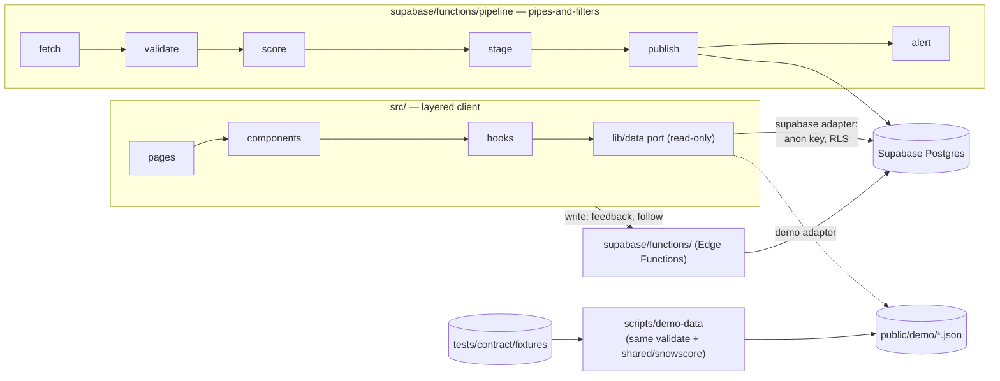
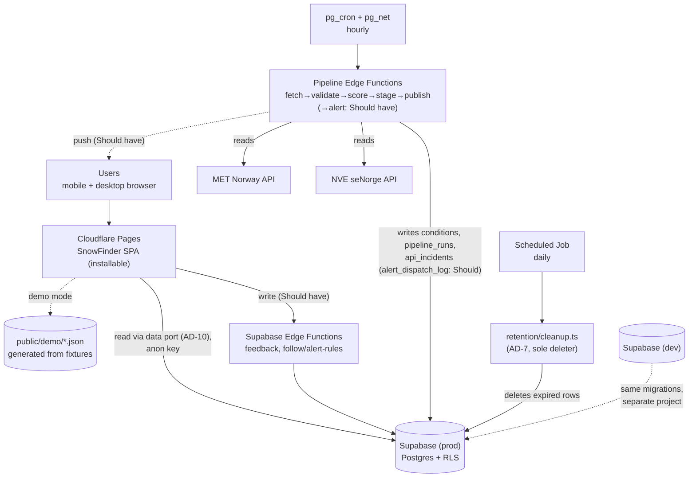

# Architecture Spine — SnowFinder

**v2 (2026-09-27):** aligned against the PRD and UX spines (Sally's DESIGN.md/EXPERIENCE.md) —
adds AD-8 (map/list as one route) and AD-9 (design tokens have one source), tightens AD-2 for
the mørketid fallback flag. AD-1 through AD-7 and the stack are unchanged from v1; `AD` IDs are
never renumbered (see `.memlog.md` in
`project-workspace/planning-artifacts/architecture/architecture-G18-bikila-dymbe-gela-james-2026-09-22/`
for the full decision trail).

**v3 (2026-10-07):** aligned with PRD v2 after the course teacher's feedback (approved
[sprint change proposal](../../project-workspace/planning-artifacts/sprint-change-proposal-2026-10-07.md)).
- Adds AD-10: one data-access port with a Supabase adapter and a demo adapter, so the app runs
  from a clean clone (PRD FR-30).
- Adds AD-11: `pipeline_runs` for data quality and lineage (NFR-DQ1–3).
- Adds AD-12: shapes that cross a boundary (port data, filter parameters, golden tables) are
  Zod schemas in `shared/contracts/`.
- Adds the sections *Tables and Owners*, *Running Locally* and *Environments*.
- AD-1 now points to the new port.
- AD-2 is simplified for v1: queue/resume, retries and the circuit breaker are *Should have*.
- AD-6 now covers all shared domain logic, not only the score.

`AD` IDs are stable.

## Design Paradigm

Two paradigms, cleanly separated by directory:

- **Backend (`supabase/`): Pipes-and-Filters.** The hourly job is a chain of independent
  stages — fetch → schema-validate → score → stage → publish (atomic, ≥95% valid) → alert —
  exactly as specified in the product brief. Each stage is one file; each only reads the
  previous stage's output shape and writes its own.
- **Frontend (`src/`): thin layered client, read-only against its data source.** Pages →
  components → hooks → `lib/data` (a read-only port with a Supabase adapter and a demo
  adapter, AD-10). The client never *writes* the
  authoritative published SnowScore — that's the pipeline's job (AD-1) — and never holds a
  service-role key. It *does* compute SnowScore locally, for the explainer page's "prøv
  selv" calculator, using the exact same shared module the pipeline uses (AD-6) — never a
  second copy of the formula.


```mermaid
flowchart LR
    subgraph FE["src/ — layered client"]
        P[pages] --> C[components]
        C --> H[hooks]
        H --> L["lib/data port (read-only)"]
    end
    subgraph BE["supabase/functions/pipeline — pipes-and-filters"]
        F[fetch] --> V[validate] --> S[score] --> ST[stage] --> PB[publish] --> AL[alert]
    end
    L -- "supabase adapter:<br/>anon key, RLS" --> DB[(Supabase Postgres)]
    L -. "demo adapter" .-> DEMO[("public/demo/*.json")]
    FIX[("tests/contract/fixtures")] --> GEN["scripts/demo-data<br/>(same validate + shared/snowscore)"] --> DEMO
    PB --> DB
    FE -- "write: feedback, follow" --> EF["supabase/functions/ (Edge Functions)"]
    EF --> DB
```

## Invariants & Rules

### AD-1 — Client is read-only against the database; each table has exactly one writer

- **Binds:** `src/**`, `supabase/functions/**`
- **Prevents:** a component bypassing Row Level Security, a service-role key ending up in
  the frontend bundle, or two Edge Functions racing on the same table (e.g. `follow/`
  registering a rule while `alert.ts` also mutates it).
- **Rule:** `src/` may only reach Supabase through the Supabase adapter of the data port,
  `src/lib/data/supabase/` *(v3; was `src/lib/supabase/client.ts`)*. It uses the anon key, for
  `select` queries and read-only RPC functions (`stable`, `security invoker`, e.g. the filter
  function) on RLS-scoped tables. Every write goes through an Edge Function, and each
  table has exactly one writer:
  - `alert_rules` is written only by `supabase/functions/follow/`;
  - `feedback` only by `supabase/functions/feedback/`;
  - `pipeline_runs` only by `pipeline/publish.ts` (AD-11);
  - `pipeline/alert.ts` never writes to `alert_rules`. It writes dedup and last-notified state
    to its own `alert_dispatch_log` table instead.

  No other file constructs a Supabase client.

### AD-2 — Pipeline stages are independent files with one staging contract

- **Binds:** `supabase/functions/pipeline/**`, `supabase/migrations/**`
- **Prevents:** two stages (e.g. `fetch` and `validate`) independently assuming different
  shapes for the staging row — one writing typed columns, another writing a raw JSON
  blob — and silently diverging.
- **Rule:** each pipeline stage (`fetch`, `validate`, `score`, `stage`, `publish`, `alert`)
  is its own file under `supabase/functions/pipeline/`, is idempotent (same input → same
  output, safe to re-run), and only *appends* typed columns to the single migration that
  defines `conditions_staging` — no stage introduces a parallel `raw_payload`/`jsonb` shape
  or a second staging table. One scheduled entrypoint orchestrates the chain in order.
  **(v3, PRD FR-2/FR-6):** In v1 that entrypoint is a single hourly job over the whole catalog,
  with capped concurrency.
  - An interrupted run publishes nothing and is simply re-run the next hour.
  - Queued batches that resume where they stopped are *Should have*, and so are
    retries/backoff and the per-source circuit breaker (FR-6b).
  - Staging, the atomic ≥95 % publish and its publish lock stay *Must have*: they carry the
    data-quality guarantee.
  - `publish.ts` copies every `conditions_staging` column, including `skivindu_uten_dagslys`,
    to `conditions` and never recomputes a value. A test compares the two column lists.
  - The job is triggered by `pg_cron` and `pg_net`. It must finish within the Edge Function
    wall-clock limit of the Supabase plan in use. *[OPEN — measure a full ~300-location run
    in Story 1.3. If it does not fit with a safety margin, queued batches (FR-2) move back to
    Must have through `bmad-correct-course`.]*
  - The `alert` stage exists only once Epic 4 is built. Until then the chain ends at
    `publish`.
  **(v2, PRD FR-17):** when `score.ts` falls back to the mørketid rule for beste skivindu (no
  daylight hours in the 48h window), it writes an explicit `skivindu_uten_dagslys: boolean`
  column to `conditions_staging` — the frontend reads this flag verbatim and never re-derives
  the mørketid state itself (e.g. by counting daylight hours client-side), so the stedsside's
  «Mørketid – vindu vist uten dagslys» label can never disagree with what the pipeline actually
  computed.

### AD-3 — Two Supabase environments, migrations as the only schema change path

- **Binds:** `supabase/migrations/**`, CI
- **Prevents:** dev and prod schemas drifting, or a hand-edited prod table nobody can
  reproduce.
- **Rule:** dev and prod are separate Supabase projects. `supabase/migrations/*.sql` is the
  only way the schema changes. CI applies migrations to dev on every PR and to prod only
  after merge to `main`.

### AD-4 — Unit/property tests colocated, E2E and contract tests separated

- **Binds:** all test code
- **Prevents:** contributors putting the same kind of test in different places, or a
  Playwright run needing the Vitest runtime (or vice versa).
- **Rule:** Vitest + fast-check tests live as `*.test.ts` next to the file they test
  (`src/**` and `supabase/functions/**`). Playwright E2E specs live under `tests/e2e/`.
  Contract tests against recorded MET/NVE responses live under `tests/contract/`, fixtures
  in `tests/contract/fixtures/`.

### AD-5 — Catalog build is offline; `locations` is read-only at runtime

- **Binds:** `scripts/build-catalog/**`, `supabase/functions/pipeline/**`
- **Prevents:** `src/` or `supabase/functions/` importing OSM/Kartverket-fetching code at
  request time (reintroducing the fragile third-party dependency the pipeline's circuit
  breakers exist to avoid), and `publish.ts` silently upserting new locations from
  MET/NVE coordinates instead of going through catalog review.
- **Rule:** the stedskatalog build (OpenStreetMap + Kartverket → ~300 seed locations) is a
  manually-run script under `scripts/build-catalog/` that only ever *produces* a
  `supabase/migrations/` seed file. `locations` is migration-seeded and read-only at
  runtime: no pipeline stage or Edge Function may `INSERT`/`UPDATE`/`DELETE` it. Nothing
  under `src/` or `supabase/functions/` imports the build script.

### AD-6 — One scoring module, shared by name across both runtimes

- **Binds:** `shared/snowscore.ts`, `src/lib/snowscore.ts`, `supabase/functions/pipeline/score.ts`
- **Prevents:** the calculator (browser) and the pipeline (Deno Edge Function) each shipping
  their own copy of the SnowScore formula and drifting apart — the brief is explicit this
  must never happen.
- **Rule:** `shared/snowscore.ts` is the single canonical implementation: pure TypeScript,
  zero dependencies on React, npm packages, or Deno/Node/browser globals, so it runs
  unmodified under both Vite and Deno. `src/lib/snowscore.ts` and
  `supabase/functions/pipeline/score.ts` both import it by relative path — neither
  reimplements or copies the formula. A parity test runs a fixed golden input set through
  both import paths and asserts identical output.
  **(v3)** The same rule covers all deterministic domain logic that the pipeline and the
  demo-data generator (AD-10) must agree on, and it lives in `shared/`:
  - response validation (the Zod schemas in `shared/contracts/`);
  - mapping raw hours to score input, with rounding and the incomplete-data rule
    (`shared/snowscore.ts`);
  - filtering (`shared/filter.ts`);
  - data-age thresholds (`shared/freshness.ts`);
  - beste skivindu (`shared/skivindu.ts`, when FR-17 is built).

  Pipeline stage files are thin Deno wrappers around it, doing only I/O and orchestration.
  `zod` is the only third-party import allowed in `shared/`, through one specifier that
  resolves in Vite and in Deno (an import map). *[OPEN — verify in the first Edge Function
  story (1.3) that `supabase functions serve` and deploy resolve `shared/` imports; if they
  don't, a build step copies `shared/` into `supabase/functions/_shared/`.]*

### AD-7 — Retention deletions have one owner

- **Binds:** `supabase/functions/retention/**`
- **Prevents:** two different functions independently deleting from the same table on
  different schedules, or a TTL rule from the brief (24h rate-limit hash, 12-month feedback,
  7-day weather data) being implemented nowhere at all.
- **Rule:** a single scheduled function, `supabase/functions/retention/cleanup.ts`, owns
  every TTL deletion in the brief. No other Edge Function or pipeline stage deletes rows
  from `feedback`, the rate-limit hash table, or historical weather data. **(v3)** The
  retention for each table is in *Tables and Owners* below. `pipeline_runs` is kept for
  90 days, because it is the evidence for NFR-3 and SM-13.

### AD-8 — Map and list are one route, one data hook *(v2, PRD FR-13/FR-21, EXPERIENCE.md IA)*

- **Binds:** `src/pages/Utforsk.tsx`, `src/hooks/useSteder.ts`
- **Prevents:** the map view and the accessible list view being built as two separate pages
  with two separate data-fetching paths that quietly diverge in which filter parameters they
  read or how they interpret the URL — the exact failure mode that would make the list a
  second-class citizen instead of PRD FR-13's "fullverdig alternativ."
- **Rule:** `Utforsk` is the *only* route for exploring the catalog. It reads `visning=kart|liste`
  from the URL (default `kart`) purely to choose which presentation component to render
  (`KartVisning` or `ListeVisning`); both read the same filter query params and call the same
  `useSteder()` hook for data. No component under `src/pages/` duplicates the Supabase query
  that `useSteder` wraps.

### AD-9 — Design tokens have one source in code *(v2, DESIGN.md)*

- **Binds:** `src/lib/theme.ts`, `src/styles/tokens.css`, every component under `src/components/`
- **Prevents:** components hardcoding DESIGN.md's hex/px values independently and silently
  drifting from the spec — the same class of problem AD-6 solves for the SnowScore formula,
  applied to visual tokens.
- **Rule:** `src/lib/theme.ts` is the single source of truth for every DESIGN.md frontmatter
  token (colors, typography, rounded, spacing), as plain TypeScript constants keyed identically
  to DESIGN.md. `src/styles/tokens.css` defines CSS custom properties with the same values for
  ordinary component styling; a colocated `theme.test.ts` parses `tokens.css` and asserts it
  matches `theme.ts`, failing CI on drift. The one JS-only consumer that CSS can't reach —
  Leaflet marker fill colors — imports directly from `theme.ts`, never a third hardcoded color
  list. No component under `src/components/` writes a literal hex/px value for anything
  DESIGN.md already names.

### AD-10 — Data access has one port and two adapters *(v3, PRD FR-30)*

- **Binds:** `src/lib/data/**`, `src/hooks/**`, `scripts/demo-data/**`, `shared/filter.ts`,
  `public/demo/**`
- **Prevents:**
  - components or hooks deciding "demo or real" on their own;
  - the demo dataset drifting from what the pipeline would produce;
  - the demo and the database answering the same filter differently.
- **Rule:**
  - **The port.** `src/` reads data only through `src/lib/data/`, a typed read-only port:
    `querySteder(FilterParams, sort)`, `getSted(id)`, `latestRun()` and `capabilities`.
    Filtering happens only inside an adapter, never again in hooks or components. The data
    shapes are fixed by AD-12.
  - **Two adapters implement it:**
    - `supabase/`: the only file that creates a Supabase client (AD-1);
    - `demo/`: reads `public/demo/*.json`.

    `VITE_DATA_SOURCE=demo|supabase` picks one at build time through a single static
    `import.meta.env` branch in `src/lib/data/index.ts`, so the demo bundle never contains
    `@supabase/supabase-js`. `demo` is the default in `.env.example`. No other file reads
    `VITE_DATA_SOURCE`. Components ask `capabilities` (`canFollow`, `canSendFeedback`, false in
    demo) whether to enable write features. Writes (follow, feedback) go only through
    `src/lib/api/` to Edge Functions, never through the port.
  - **Demo data.** The dataset is generated by `scripts/demo-data/` from
    `tests/contract/fixtures/`, using the same validation code and `shared/snowscore.ts` as the
    pipeline (AD-6). It is never hand-written. Same fixtures → byte-identical output, which a
    test checks.
  - **Demo clock.** The dataset carries `demoNow`, set to the newest source timestamp in the
    fixtures. `src/lib/clock.ts` is the only source of "now" in `src/`: it returns `demoNow` in
    demo mode and the wall clock otherwise. No other file calls `Date.now()` or `new Date()`
    without arguments, and lint enforces that. Data age is `now() − source timestamp`,
    compared with the thresholds in `shared/freshness.ts` (3 h stale, 12 h hidden).
  - **Filter logic.** It lives in `shared/filter.ts`, pure TS, and the demo adapter uses it.
    The database's parameterised filter function must return the same results for the filter
    golden table (PRD FR-20). The shared-TS golden test is CI-blocking now. The database golden
    test runs in the CI job that starts local Supabase (see *Environments*) once the Supabase
    adapter exists.

### AD-11 — Each pipeline run leaves one quality record; published rows are traceable *(v3, PRD NFR-DQ1–3)*

- **Binds:** `supabase/functions/pipeline/**`, `supabase/migrations/**`, `shared/contracts/**`
- **Prevents:**
  - several stages each writing their own idea of "how the run went";
  - published scores that cannot be traced back to the run and source data behind them;
  - the documented data contract drifting from the Zod schemas that enforce it.
- **Rule:**
  - **The run record.** `publish.ts` is the only writer of `pipeline_runs`, with exactly one
    row per run: start, duration, location count, valid share, rejected responses per source,
    locations with incomplete data, whether the batch was published, and an error reason.
    - The scheduled entrypoint creates `run_id` and a typed `RunContext`
      (`shared/contracts/run.ts`). Earlier stages add their counts to it and never write run
      status themselves.
    - The entrypoint always calls `publish.ts`'s run-record step last, in a `finally`, so a
      run that fails in `fetch` or `validate` still leaves a row with `published = false` and
      a reason.
    - A re-run gets a new `run_id`.
    - A run killed by the platform's wall-clock limit leaves no row. The next run reports the
      gap: "previous run did not finish".
  - **Rejected responses.** `validate.ts` writes one `api_incidents` row per rejected response,
    with the details.
  - **Lineage.** Every published `conditions` row carries `run_id` and the source's
    timestamp.
  - **The data contract.** MET and NVE Zod schemas live in `shared/contracts/` next to
    `data-dictionary.md` (field, unit, valid range, source). A test fails when the two
    disagree.

### AD-12 — Shapes that cross a boundary are Zod schemas in `shared/contracts/` *(v3)*

- **Binds:** `shared/contracts/**`, `src/lib/data/**`, `scripts/demo-data/**`,
  `supabase/functions/**`, `supabase/migrations/**`, `tests/**/golden/**`
- **Prevents:**
  - the demo JSON and the `conditions` rows reaching the UI in different shapes (snake_case
    vs camelCase, joined vs split, different nullability);
  - three components or stories each inventing their own filter-parameter or URL format;
  - golden tables whose input format nobody owns.
- **Rule:**
  - **Port shapes.** `Sted`, `StedConditions`, `PipelineRun`, `FilterParams` and
    `Capabilities` are defined once as Zod schemas in `shared/contracts/`, with TS types
    inferred from them and camelCase fields.
  - **One mapper.** `rowToSted` maps database rows to `Sted`. Both adapters parse their data
    through the schema before returning it. A parity test checks that the demo record and the
    mapped database row for the same fixture are equal.
  - **The demo dataset** `public/demo/*.json` is validated against the same schemas when it is
    generated.
  - **Filter parameters.** `shared/filter.ts` owns `FilterParams` and the only
    `parseFilterParams` and `serializeFilterParams` (URL ↔ filter). `useSteder` and the URL
    state use them. The SQL filter function takes the same parameters as a single `jsonb`.
  - **Golden tables.** They live as JSON files under `tests/golden/`
    (`snowscore.json`, `filter.json`, later `skivindu.json`), in the `FilterParams` and port
    shapes. They state the boundary rules: inclusive or exclusive limits, nulls, tie-break
    order.

## Tables and Owners *(v3)*

| Table | Writer (only one) | Read by client? | Retention (AD-7, `cleanup.ts`) | MoSCoW |
| --- | --- | --- | --- | --- |
| `locations` | migration seed (AD-5) | yes | — | Must |
| `conditions_staging` | `pipeline/stage.ts` | no | overwritten each run | Must |
| `conditions` | `pipeline/publish.ts` | yes (via filter RPC/select) | 7 days | Must |
| `pipeline_runs` | `pipeline/publish.ts` (AD-11) | latest row only | 90 days | Must |
| `api_incidents` | `pipeline/validate.ts` | no | 90 days | Must |
| `alert_rules` (incl. push subscription) | `functions/follow/` | no | on unsubscribe | Should |
| `alert_dispatch_log` | `pipeline/alert.ts` | no | 7 days | Should |
| `feedback` | `functions/feedback/` | no | 12 months | Should |
| `rate_limit_hits` | shared helper `functions/_shared/rateLimit.ts`, called by `follow/` and `feedback/` (rows keyed by function) | no | 24 hours | Should |

## Consistency Conventions

| Concern | Convention |
| --- | --- |
| Naming (files, tables, functions) | `snake_case` for SQL (tables, columns, RPC functions); `camelCase` for TS values, `PascalCase` for React components/types. Pipeline stage files named after the stage verb (`fetch.ts`, `validate.ts`, …). |
| Data & formats | All timestamps stored in UTC (`timestamptz`), converted to Norwegian local time only at the UI edge. IDs are Postgres `uuid`. API error shape: `{ error: { code, message } }` from every Edge Function. |
| State & cross-cutting | Secrets only as Supabase project env vars, never committed, never in `src/`. All Edge Functions validate input with Zod before touching the database. Rejected responses write to `api_incidents`, and each run writes `pipeline_runs` (AD-11). *(v3: calling a team-notification path, e.g. a webhook, on failures and circuit-breaker trips is Should have, NFR-6.)* |
| Local run & configuration *(v3)* | Every variable the app reads is listed in `.env.example` with a safe default and a comment, and no real secret is ever stored there. A clean clone with no `.env` runs in demo mode. |
| Comments | No comments for what the code already says through naming — don't restate the obvious. Write one only for the *why*: a non-obvious constraint, a workaround for a specific API quirk (e.g. MET's `Expires` header behavior), or a rule this spine binds (e.g. `// AD-1: alert.ts never writes alert_rules`). If a reviewer would ask "why is this here?", that's the comment to write. |

## Stack

| Name | Version |
| --- | --- |
| Node.js | 24 LTS ("Krypton") |
| React | 19.3.0 |
| TypeScript | 6.0.x (last JS-based compiler line; 7.0's Go-native rewrite shipped stable July 2026, but its IDE/tooling ecosystem is still maturing — [ASSUMPTION] stay on 6.0.x for this course project, revisit for v2) |
| Vite | 8.3.0 |
| @supabase/supabase-js | 2.116.0 |
| Leaflet | 1.9.4 (stable; 2.0 is alpha-only, not used) |
| Zod | 4.6.5 |
| Vitest | 5.0.1 |
| fast-check | 4.10.1 |
| Playwright | 1.63.0 |
| date-fns-tz, SunCalc | exact versions chosen and pinned by the first story that needs them; check `date-fns-tz` compatibility with `date-fns` v4 and SunCalc's maintenance state then |
| Package manager | npm (single package at repo root; no monorepo tool — Edge Functions are separate Deno scripts, not part of the npm workspace) |
| Supabase CLI *(v3)* | pinned minimum version recorded in README by the first Edge Function story (1.3); local stack needs Docker |
| Deno *(v3)* | the version bundled with the Supabase Edge Runtime; `shared/` imports verified in Story 1.3 (AD-6 open item) |
| Scheduler *(v3)* | `pg_cron` + `pg_net` in Supabase, triggering the pipeline entrypoint hourly |

*(v3)* Versions above are the pinned project versions, checked against npm on 2026-10-07.
Newer patch releases exist for some packages (e.g. Vite 8.3.3, Vitest 5.0.3). The project
stays on its exact pins and updates them deliberately (Dependabot, deferred-work).
| Hosting | [ASSUMPTION] Cloudflare Pages for the frontend (same provider as the already-chosen Cloudflare Turnstile); Vercel is an equally valid alternative — confirm with the group |

## Structural Seed


```mermaid
flowchart TB
    U["Users<br/>mobile + desktop browser"] --> FE["Cloudflare Pages<br/>SnowFinder SPA (installable)"]
    FE -- "read via data port (AD-10),<br/>anon key" --> SB[("Supabase (prod)<br/>Postgres + RLS")]
    FE -. "demo mode" .-> DEMO[("public/demo/*.json<br/>generated from fixtures")]
    FE -- "write (Should have)" --> EF["Supabase Edge Functions<br/>feedback, follow/alert-rules"]
    EF --> SB
    CRON["pg_cron + pg_net<br/>hourly"] --> PIPE["Pipeline Edge Functions<br/>fetch→validate→score→stage→publish<br/>(→alert: Should have)"]
    PIPE -- "reads" --> MET["MET Norway API"]
    PIPE -- "reads" --> NVE["NVE seNorge API"]
    PIPE -- "writes conditions, pipeline_runs,<br/>api_incidents (alert_dispatch_log: Should)" --> SB
    PIPE -. "push (Should have)" .-> U
    RCRON["Scheduled Job<br/>daily"] --> RET["retention/cleanup.ts<br/>(AD-7, sole deleter)"]
    RET -- "deletes expired rows" --> SB
    DEV[("Supabase (dev)")] -.->|"same migrations,<br/>separate project"| SB
```

```text
/
  src/                          # frontend — layered, read-only against Supabase
    pages/                      # route-level views:
      Utforsk.tsx               #   kart+liste, ONE route (AD-8) — visning=kart|liste in URL
      Sted.tsx                  #   location page (beste skivindu, snøvarsel inline form)
      SlikBeregnerViSnowScore.tsx #  explainer page + "prøv selv" calculator
      Tilbakemelding.tsx        #   feedback form
    components/                 # shared presentational components (KartVisning, ListeVisning,
                                 #   ScoreBadge, FilterPanel, StedKort, …)
    hooks/
      useSteder.ts              #   single data-fetching hook shared by kart- and listevisning (AD-8)
    lib/
      data/                     # read-only data port (AD-10)
        supabase/               #   Supabase adapter — the only Supabase client (AD-1)
        demo/                   #   demo adapter — reads public/demo/*.json
      snowscore.ts              # re-exports shared/snowscore.ts for the calculator UI (AD-6)
      theme.ts                  # single source of truth for DESIGN.md tokens (AD-9)
      types/                    # shared TS types generated from the DB schema
    styles/
      tokens.css                # CSS custom properties mirroring theme.ts (AD-9)
    *.test.ts                   # colocated Vitest + fast-check tests (incl. theme.test.ts, AD-9)
  shared/
    snowscore.ts                # single canonical SnowScore formula (AD-6) — pure TS,
                                 #   no React/npm/Deno-specific deps, imported by BOTH
                                 #   src/lib/snowscore.ts and
                                 #   supabase/functions/pipeline/score.ts
    filter.ts                   # filter logic shared by the demo adapter and tests (AD-10)
    contracts/                  # MET/NVE Zod schemas + data-dictionary.md (AD-11)
  public/
    demo/                       # generated demo dataset, incl. demoNow (AD-10)
  supabase/
    migrations/                 # versioned SQL — the only schema change path (AD-3)
    functions/
      pipeline/                 # fetch.ts, validate.ts, score.ts, stage.ts, publish.ts, alert.ts (AD-2)
                                 #   alert.ts writes only to alert_dispatch_log, never alert_rules (AD-1)
      feedback/                 # Turnstile-verified feedback submission (write path)
      follow/                   # alert-rule registration; sole writer of alert_rules (AD-1)
      retention/
        cleanup.ts               # sole deleter of expired feedback/hash/weather rows (AD-7)
  scripts/
    build-catalog/              # one-off: OSM + Kartverket -> migrations/seed (AD-5)
    demo-data/                  # fixtures -> public/demo/*.json, same code as pipeline (AD-10)
    analysis/                   # offline forecast-vs-measured report (PRD FR-31), not runtime
  tests/
    e2e/                        # Playwright; smoke test runs in demo mode in CI (PRD SM-9)
    contract/
      fixtures/                 # recorded MET/NVE responses
  project-phase-folders/         # course documentation (see project-phase-folders/README.md)
  .github/
    workflows/                  # ci.yml, e2e.yml, deploy.yml
    agents/                     # existing BMAD agent configs — unrelated to CI
  .agents/, .claude/, _bmad/    # BMAD tooling (unchanged by this spine)
  .env.example                  # VITE_DATA_SOURCE=demo by default; no secrets (v3)
```

## Running Locally *(v3, PRD FR-30)*

| Mode | Command | Needs |
| --- | --- | --- |
| **Demo (default; for examiners)** | `npm ci && npm run dev` | Node 24 or 26+. No keys, no network calls to MET or NVE. |
| Regenerate demo data | `npm run demo:data` | Same as above; reads `tests/contract/fixtures/`. |
| Full local stack | Supabase CLI (`supabase start`, apply `supabase/migrations/`), then `VITE_DATA_SOURCE=supabase` | Docker. Used by the group and by the database filter golden test. |

Story 1.1 created an empty `src/lib/supabase/`. Story 1.10 moves it to `src/lib/data/supabase/`
under AD-10.

### Environments

| Environment | Data mode | Supabase | Used for |
| --- | --- | --- | --- |
| local-demo | `demo` | none | examiners, first run, all UI work before Supabase exists |
| local-supabase | `supabase` | local (Supabase CLI, Docker) | pipeline and Edge Function stories, DB golden test |
| CI `ci.yml` (every PR) | `demo` | none | lint, typecheck, unit/property/contract/golden tests, build; also on fork PRs without secrets |
| CI `e2e.yml` (every PR) | `demo` | none | `vite build` + `vite preview` as Playwright `webServer`, `npx playwright install --with-deps`; smoke test kart → filter → stedsside (PRD SM-9) |
| CI `db.yml` (PRs touching `supabase/` or `shared/filter.ts`, and nightly) | `supabase` | local via `supabase start` on the runner | migrations apply cleanly; DB filter golden test (AD-10) |
| preview / prod | `supabase` | dev / prod projects (AD-3) | deployed site, once hosting is chosen; migrations to prod after merge |

## Deferred

- **Mobile-native app, webcam livestream, i18n, catalog scale-out to ~1500 locations, real
  vector-field wind animation** — already explicitly out of v1 scope in the product brief;
  not re-decided here. Revisit if/when a v2 brief exists.
- **Push-notification delivery path** — brief specifies "Web Push" but not a provider
  (raw Web Push API vs. a service). Left for the story implementing snøvarsel.
- **Exact CI test-matrix/caching strategy** — `AD` above fixes *where* each test type lives
  and *that* CI runs them; tuning job parallelism/caching is an implementation detail for
  `.github/workflows/ci.yml`, not an architectural invariant. *(v3: which jobs exist and
  what data mode they use is decided in *Environments*.)*
- *(v3)* **Retry, backoff and circuit-breaker state (FR-6b, Should have).** If that state needs
  a table, the story that builds FR-6b names its single writer here first. Until then there is
  no such table.
- *(v3)* **Data source for the SnowScore accuracy analysis (FR-31, Should have).** `conditions`
  keeps only 7 days (AD-7), so the analysis cannot read history from it. Story 2.5 decides,
  through this spine, whether a compact daily snapshot is exported for analysis or the analysis
  covers a recent window only. It must not quietly extend `conditions` retention.
- *(v3)* **Copy check for planning documents.** A CI check that `project-workspace/` and
  `project-phase-folders/` copies are identical (course feedback) goes into `ci.yml` with
  Story 1.10.
