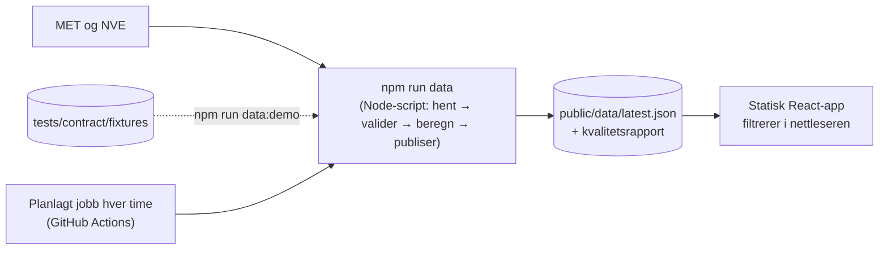

# Sprint Change Proposal 2: forenkling uten Supabase

## 1. Hva som utløste endringen

Faglæreren vurderte prosjektet som **«Vanskelig»**. Den største driveren er
**integrasjoner (Høy)**: sju eksterne tjenester. To vurderinger er «risiko» og én er «stor
risiko», og alle tre handler om Supabase, Web Push og Turnstile:
- «krever mye manuell konfigurasjon utenfor koden»;
- «vanskelige for sensor å teste»;
- «Supabase gratisnivå har begrensninger (pauser og tidsgrenser)».

Den første endringsrunden (samme dag) flyttet robusthetsmaskineriet til Bør ha og la til
demomodus. Arkitektur v3 måtte likevel la to risikoer stå åpne, og begge gjelder Supabase:
- om Deno kan importere delt kode;
- om én kjøring holder seg innenfor tidsgrensen til Edge Functions.

Gruppa (Joseph) ba derfor om å fjerne de kompliserte delene der faglæreren råder til det.

## 2. Analyse

**Påstand:** Med ~300 steder trenger SnowFinder ingen database. Hele det publiserte
datasettet er noen hundre kilobyte JSON.
- Filtrering i nettleseren over 300 rader tar millisekunder, så NFR-1 (< 2 s) holdes uten
  databasefunksjon.
- MET Locationforecast krever ingen nøkkel, bare en identifiserende User-Agent.
- Når snøvarsel og tilbakemelding er borte, finnes det ingen skriveoperasjoner fra brukere.
  Da trengs verken Edge Functions, RLS, Turnstile, hastighetsbegrensning eller personvernlogikk
  for lagrede identifikatorer.

| Fjernes | Hva det sparer |
|---|---|
| Supabase (Postgres, Edge Functions, `pg_cron`/`pg_net`, RLS, migreringer, dev- og prod-prosjekt, Deno) | Oppsett utenfor koden, nøkler, tidsgrenser, to åpne arkitekturrisikoer, `db.yml`, filtertest mot databasen |
| Snøvarsel (FR-18/19), Web Push, PWA (Story 4.1, 4.3, 4.4) | Push-tjeneste, service worker, iPhone-krav, `alert_rules`, `alert_dispatch_log` |
| Tilbakemelding (FR-27/28/29), Turnstile (Epic 5) | Konto og nøkler, Edge Function, saltet hash, sletterutine, sikkerhetstester |
| Egen sletterutine (AD-7) | Pipelinen beholder selv bare de siste kjøringene |

| Beholdes | Hvorfor |
|---|---|
| Pipes-and-filters-pipeline: hent → valider → beregn → publiser (≥ 95 % gyldige, atomisk) | Kjernen i datakvaliteten og i faglærerens «én planlagt jobb» |
| SnowScore-modulen, egenskapstester, fasittabeller, kontraktstester | Det faglæreren roste mest |
| Kvalitetsrapport per kjøring og sporbarhet (NFR-DQ) | Ingeniørnivå som kvalitet, uten ny infrastruktur |
| Kart, liste, stedsside, filter, forklaringsside; skivindu og kalkulator som Bør ha | Hele brukeropplevelsen |
| Demomodus | Blir enklere: samme script kjørt på lagrede svar |

## 3. Anbefalt vei

**MVP-gjennomgang og arkitekturforenkling.** Brukeropplevelsen er den samme; det som endres er
hvor dataene ligger.

| | |
|---|---|
| Innsats | Middels. Dokumentene oppdateres i denne runden; koden påvirkes nesten ikke, siden bare Story 1.1 er bygget. |
| Risiko | Lavere. Begge åpne arkitekturrisikoer forsvinner, og sensor kan kjøre alt lokalt, også ekte data. |
| Tidsplan | Positiv. Ingen ventetid på Supabase-oppsett før sprint 2. |

**Ny forutsetning:** Den planlagte jobben og publiseringen bruker GitHub Actions og
GitHub Pages. Begge må slås på i repoet av en administrator. Det samme gjelder vanlig CI,
som ikke har kjørt ennå.

## 4. Endringer

### 4.1 Produktbrief (begge kopier)
- **Løsningen:** pipeline som Node-script, publisert som datafil; appen er en statisk side.
- **Snøvarsel** og **tilbakemelding uten konto** fjernes fra «The Solution». De står som
  «Ikke i v1», med begrunnelse.
- **MoSCoW:** snøvarsel, tilbakemelding og installerbar app (PWA) flyttes til «Ikke i v1».
- **Arkitektur, database og personvern** forenkles: ingen database, ingen lagrede
  identifikatorer.
- **Risikoer** og **suksesskriterier** oppdateres.

### 4.2 PRD (begge kopier)
- **FR-2:** henting med et Node-script, utløst hver time eller lokalt.
- **FR-5:** atomisk publisering til en datafil.
- **FR-18/19, FR-27/28/29:** flyttes til §6.3 «Ikke i v1» med begrunnelse; ID-ene beholdes.
- **FR-20:** filtrering i nettleseren med delt filterlogikk; ingen databasefunksjon.
- **FR-30:** demomodus som `npm run data:demo`.
- **NFR-5:** erstattes: ingen skriveoperasjoner fra brukere, ingen hemmeligheter i klienten.
- **NFR-Privacy:** forenkles; ingen identifikatorer behandles.
- **NFR-DQ2:** kvalitetsrapport per kjøring som JSON.
- **UJ-2** (følg sted og varsel) utgår.
- §9 og §10 oppdateres.

### 4.3 Arkitektur (begge kopier), v4
- Paradigmet består (pipes-and-filters og en tynn klient som bare leser), men pipelinen er et
  Node-script i `scripts/pipeline/`.
- **AD-1** skrives om: klienten leser bare den publiserte datafilen og skriver ingenting.
- **AD-3 og AD-7** pensjoneres (ID-ene gjenbrukes ikke).
- **AD-5, AD-10, AD-11 og AD-12** forenkles: én datakontrakt for den publiserte filen, ingen
  adaptere.
- «Tables and Owners» blir «Data Files and Owners». «Environments» forenkles.

### 4.4 Overlevering til senere steg (ikke i denne runden)
- **Sally (UX):** kursets skjermkrav må kobles på nytt, fordi «profil → snøvarsel» og
  «innsjekking → tilbakemelding» faller bort.
- **John (epics):** Epic 5 og Story 4.1, 4.3 og 4.4 blir «Ikke i v1». Story 1.2, 1.3, 1.5 og 1.10
  skrives om. Ny story for den planlagte jobben. Må ha/Bør ha-merking som i runde 1.
- **Story 1.1 (PR #10)** opprettet tomme mapper for Supabase (`supabase/`, `src/lib/supabase/`).
  De fjernes i Story 1.10.
- **AGENTS.md** (`bmad-project-context`) må oppdateres.

## 5. Overlevering

**Omfang: Major.** I denne runden: brief, PRD og arkitektur (§4.1–4.3). Deretter, i rekkefølge:
Sally (UX), John (epics), sprintplanlegging, `bmad-project-context`, og Amelia (Story 1.4 og 1.10).

**Suksesskriterier:**
- Ingen Must have-funksjon krever en ekstern konto eller nøkkel.
- Sensor kan kjøre både demodata og ekte data lokalt etter README.
- Ingen dokument beskriver fortsatt Supabase, Web Push eller Turnstile som en del av v1.
